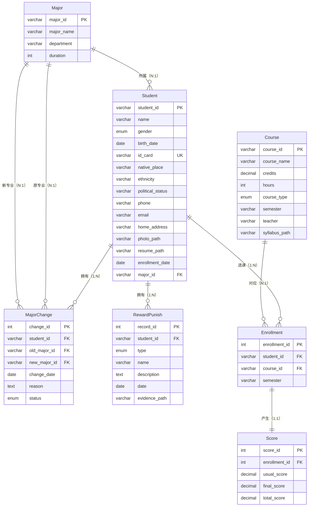

# 学籍管理系统 — 课程设计报告

> **课程名称：** 数据库系统及应用课程设计  
> **课题名称：** 学籍管理系统  
> **姓名：** 李易  
> **学号：** PB23111726  
> **架构类型：** B/S 架构  
> **开发语言：** Python + Flask  
> **数据库平台：** MySQL 8.0  

---

## 目录

1. [前期设计](#1-前期设计)
   - 1.1 需求分析
   - 1.2 ER 图
   - 1.3 数据库模式设计
   - 1.4 3NF 合规说明
2. [实现说明](#2-实现说明)
   - 2.1 系统架构
   - 2.2 项目目录结构
   - 2.3 核心代码解析
   - 2.4 数据库对象实现
3. [结果展示](#3-结果展示)
4. [测试说明](#4-测试说明)
5. [总结与体会](#5-总结与体会)

---

## 1. 前期设计

### 1.1 需求分析

本系统为学籍管理系统，采用 B/S 架构，实现学生基本信息、专业变更、奖惩情况、课程及成绩的数字化管理，并支持图片、视频、文件的上传、下载、查看与管理功能。

系统共包含 **7 个功能模块、40 项功能需求**，覆盖如下领域：

| 模块 | 功能数 | 核心功能 |
|------|--------|----------|
| 学生基本信息管理 | 9 | 录入、查询、修改、软删除、分页浏览、照片上传/查看/下载、简历附件上传/下载 |
| 专业变更管理 | 5 | 专业信息维护（CRUD）、变更记录录入、审批状态更新（待审批→已通过/已驳回）、变更历史查询、转入/转出统计 |
| 奖惩情况管理 | 8 | 奖惩记录录入/查询/修改/删除、图片/视频/文件材料上传、材料在线查看、材料下载 |
| 课程管理 | 7 | 课程信息录入/查询/修改/删除、分页浏览、教学大纲上传、教学资料上传、文件下载 |
| 课程成绩管理 | 8 | 选课记录管理、成绩录入、总评自动计算（平时×40%+期末×60%）、成绩查询/修改、GPA 计算、课程平均分统计、成绩排名 |
| 系统管理 | 3 | 管理员登录/登出、账号管理、密码修改 |
| **合计** | **40** | **图片、视频、文件全覆盖** |

### 1.2 ER 图



**实体间关系汇总：**

| 父实体 | 关系名 | 子实体 | 基数 | 外键 |
|--------|--------|--------|------|------|
| Major | 所属 | Student | N:1 | Student.major_id |
| Student | 拥有 | MajorChange | 1:N | MajorChange.student_id |
| Major | 原专业 | MajorChange | N:1 | MajorChange.old_major_id |
| Major | 新专业 | MajorChange | N:1 | MajorChange.new_major_id |
| Student | 拥有 | RewardPunish | 1:N | RewardPunish.student_id |
| Student | 选课 | Enrollment | 1:N | Enrollment.student_id |
| Course | 对应 | Enrollment | N:1 | Enrollment.course_id |
| Enrollment | 产生 | Score | 1:1 | Score.enrollment_id (UNIQUE) |

### 1.3 数据库模式设计

> 数据库名称：`student_management`，字符集：`utf8mb4`，引擎：`InnoDB`。

#### 1.3.1 专业表 (Major)

| 字段名 | 类型 | 约束 | 说明 |
|--------|------|------|------|
| major_id | VARCHAR(20) | PRIMARY KEY | 专业编号 |
| major_name | VARCHAR(100) | NOT NULL | 专业名称 |
| department | VARCHAR(100) | NOT NULL | 所属院系 |
| duration | INT | DEFAULT 4 | 学制（年） |

```sql
CREATE TABLE Major (
    major_id    VARCHAR(20) PRIMARY KEY COMMENT '专业编号',
    major_name  VARCHAR(100) NOT NULL COMMENT '专业名称',
    department  VARCHAR(100) NOT NULL COMMENT '所属院系',
    duration    INT DEFAULT 4 COMMENT '学制（年）'
) ENGINE=InnoDB DEFAULT CHARSET=utf8mb4 COMMENT='专业表';
```

#### 1.3.2 学生表 (Student)

| 字段名 | 类型 | 约束 | 说明 |
|--------|------|------|------|
| student_id | VARCHAR(20) | PRIMARY KEY | 学号 |
| name | VARCHAR(50) | NOT NULL | 姓名 |
| gender | ENUM('男','女') | NOT NULL | 性别 |
| birth_date | DATE | | 出生日期 |
| id_card | VARCHAR(18) | UNIQUE | 身份证号 |
| native_place | VARCHAR(100) | | 籍贯 |
| ethnicity | VARCHAR(50) | | 民族 |
| political_status | VARCHAR(50) | | 政治面貌 |
| phone | VARCHAR(20) | | 联系电话 |
| email | VARCHAR(100) | | 邮箱 |
| home_address | VARCHAR(255) | | 家庭地址 |
| photo_path | VARCHAR(255) | | 照片存储路径 |
| resume_path | VARCHAR(255) | | 简历存储路径 |
| enrollment_date | DATE | | 入学日期 |
| major_id | VARCHAR(20) | FK → Major | 当前专业ID |
| is_deleted | TINYINT(1) | DEFAULT 0 | 软删除标记 |

```sql
CREATE TABLE Student (
    student_id       VARCHAR(20) PRIMARY KEY COMMENT '学号',
    name             VARCHAR(50) NOT NULL COMMENT '姓名',
    gender           ENUM('男','女') NOT NULL COMMENT '性别',
    birth_date       DATE COMMENT '出生日期',
    id_card          VARCHAR(18) UNIQUE COMMENT '身份证号',
    native_place     VARCHAR(100) COMMENT '籍贯',
    ethnicity        VARCHAR(50) COMMENT '民族',
    political_status VARCHAR(50) COMMENT '政治面貌',
    phone            VARCHAR(20) COMMENT '联系电话',
    email            VARCHAR(100) COMMENT '邮箱',
    home_address     VARCHAR(255) COMMENT '家庭地址',
    photo_path       VARCHAR(255) COMMENT '照片存储路径',
    resume_path      VARCHAR(255) COMMENT '简历存储路径',
    enrollment_date  DATE COMMENT '入学日期',
    major_id         VARCHAR(20) COMMENT '当前专业ID',
    is_deleted       TINYINT(1) DEFAULT 0 COMMENT '软删除标记',
    FOREIGN KEY (major_id) REFERENCES Major(major_id)
        ON DELETE SET NULL ON UPDATE CASCADE
) ENGINE=InnoDB DEFAULT CHARSET=utf8mb4 COMMENT='学生表';
```

> **多媒体字段说明：** `photo_path` 存储学生证件照片的文件路径（支持 jpg/png），`resume_path` 存储简历附件路径（支持 pdf/doc/docx）。上传时文件名以学号为前缀，存储在 `static/uploads/` 目录下。

#### 1.3.3 专业变更记录表 (MajorChange)

| 字段名 | 类型 | 约束 | 说明 |
|--------|------|------|------|
| change_id | INT | PK, AUTO_INCREMENT | 变更ID |
| student_id | VARCHAR(20) | FK → Student | 学号 |
| old_major_id | VARCHAR(20) | FK → Major | 原专业ID |
| new_major_id | VARCHAR(20) | FK → Major, NOT NULL | 新专业ID |
| change_date | DATE | NOT NULL | 变更日期 |
| reason | TEXT | | 变更原因 |
| status | ENUM('待审批','已通过','已驳回') | DEFAULT '待审批' | 审批状态 |

```sql
CREATE TABLE MajorChange (
    change_id     INT AUTO_INCREMENT PRIMARY KEY COMMENT '变更ID',
    student_id    VARCHAR(20) NOT NULL COMMENT '学号',
    old_major_id  VARCHAR(20) COMMENT '原专业ID',
    new_major_id  VARCHAR(20) NOT NULL COMMENT '新专业ID',
    change_date   DATE NOT NULL COMMENT '变更日期',
    reason        TEXT COMMENT '变更原因',
    status        ENUM('待审批','已通过','已驳回') DEFAULT '待审批' COMMENT '审批状态',
    FOREIGN KEY (student_id) REFERENCES Student(student_id) ON DELETE CASCADE ON UPDATE CASCADE,
    FOREIGN KEY (old_major_id) REFERENCES Major(major_id) ON DELETE SET NULL ON UPDATE CASCADE,
    FOREIGN KEY (new_major_id) REFERENCES Major(major_id) ON DELETE CASCADE ON UPDATE CASCADE
) ENGINE=InnoDB DEFAULT CHARSET=utf8mb4 COMMENT='专业变更记录表';
```

#### 1.3.4 奖惩记录表 (RewardPunish)

| 字段名 | 类型 | 约束 | 说明 |
|--------|------|------|------|
| record_id | INT | PK, AUTO_INCREMENT | 记录ID |
| student_id | VARCHAR(20) | FK → Student, NOT NULL | 学号 |
| type | ENUM('奖励','惩罚') | NOT NULL | 类型 |
| name | VARCHAR(200) | NOT NULL | 奖惩名称 |
| description | TEXT | | 描述 |
| date | DATE | NOT NULL | 奖惩日期 |
| evidence_path | VARCHAR(500) | | 证明材料路径（可多文件，逗号分隔） |

```sql
CREATE TABLE RewardPunish (
    record_id      INT AUTO_INCREMENT PRIMARY KEY COMMENT '记录ID',
    student_id     VARCHAR(20) NOT NULL COMMENT '学号',
    type           ENUM('奖励','惩罚') NOT NULL COMMENT '类型',
    name           VARCHAR(200) NOT NULL COMMENT '奖惩名称',
    description    TEXT COMMENT '描述',
    date           DATE NOT NULL COMMENT '奖惩日期',
    evidence_path  VARCHAR(500) COMMENT '证明材料路径（支持多文件）',
    FOREIGN KEY (student_id) REFERENCES Student(student_id) ON DELETE CASCADE ON UPDATE CASCADE
) ENGINE=InnoDB DEFAULT CHARSET=utf8mb4 COMMENT='奖惩记录表';
```

> **多媒体说明：** `evidence_path` 字段支持存储多个文件路径（逗号分隔），可上传图片（jpg/png）、视频（mp4）、文档（pdf/doc/docx）三类证明材料。前端支持在线预览图片、播放视频及下载所有类型文件。

#### 1.3.5 课程表 (Course)

| 字段名 | 类型 | 约束 | 说明 |
|--------|------|------|------|
| course_id | VARCHAR(20) | PRIMARY KEY | 课程编号 |
| course_name | VARCHAR(100) | NOT NULL | 课程名称 |
| credits | DECIMAL(3,1) | NOT NULL | 学分 |
| hours | INT | NOT NULL | 总学时 |
| course_type | ENUM('必修','选修','公选') | NOT NULL | 课程类型 |
| semester | VARCHAR(20) | | 开课学期 |
| teacher | VARCHAR(50) | | 授课教师 |
| syllabus_path | VARCHAR(255) | | 教学大纲文件路径 |
| material_path | VARCHAR(500) | | 教学资料路径（多文件） |
| description | TEXT | | 课程描述/备注 |

```sql
CREATE TABLE Course (
    course_id      VARCHAR(20) PRIMARY KEY COMMENT '课程编号',
    course_name    VARCHAR(100) NOT NULL COMMENT '课程名称',
    credits        DECIMAL(3,1) NOT NULL COMMENT '学分',
    hours          INT NOT NULL COMMENT '总学时',
    course_type    ENUM('必修','选修','公选') NOT NULL COMMENT '课程类型',
    semester       VARCHAR(20) COMMENT '开课学期',
    teacher        VARCHAR(50) COMMENT '授课教师',
    syllabus_path  VARCHAR(255) COMMENT '教学大纲文件路径',
    material_path  VARCHAR(500) COMMENT '教学资料路径',
    description    TEXT COMMENT '课程描述/备注'
) ENGINE=InnoDB DEFAULT CHARSET=utf8mb4 COMMENT='课程表';
```

> **多媒体说明：** `syllabus_path` 存储教学大纲文件（pdf/doc/docx），`material_path` 存储教学资料（支持多文件，逗号分隔）。

#### 1.3.6 选课记录表 (Enrollment)

| 字段名 | 类型 | 约束 | 说明 |
|--------|------|------|------|
| enrollment_id | INT | PK, AUTO_INCREMENT | 选课ID |
| student_id | VARCHAR(20) | FK → Student, NOT NULL | 学号 |
| course_id | VARCHAR(20) | FK → Course, NOT NULL | 课程编号 |
| semester | VARCHAR(20) | NOT NULL | 选课学期 |

```sql
CREATE TABLE Enrollment (
    enrollment_id  INT AUTO_INCREMENT PRIMARY KEY COMMENT '选课ID',
    student_id     VARCHAR(20) NOT NULL COMMENT '学号',
    course_id      VARCHAR(20) NOT NULL COMMENT '课程编号',
    semester       VARCHAR(20) NOT NULL COMMENT '选课学期',
    UNIQUE KEY uk_student_course_sem (student_id, course_id, semester),
    FOREIGN KEY (student_id) REFERENCES Student(student_id) ON DELETE CASCADE ON UPDATE CASCADE,
    FOREIGN KEY (course_id) REFERENCES Course(course_id) ON DELETE CASCADE ON UPDATE CASCADE
) ENGINE=InnoDB DEFAULT CHARSET=utf8mb4 COMMENT='选课记录表';
```

> **设计说明：** UNIQUE 约束 `(student_id, course_id, semester)` 确保同一学生不会在同一学期重复选择同一门课程。

#### 1.3.7 成绩表 (Score)

| 字段名 | 类型 | 约束 | 说明 |
|--------|------|------|------|
| score_id | INT | PK, AUTO_INCREMENT | 成绩ID |
| enrollment_id | INT | FK → Enrollment, UNIQUE | 选课ID（一对一） |
| usual_score | DECIMAL(5,2) | DEFAULT 0 | 平时成绩 |
| final_score | DECIMAL(5,2) | DEFAULT 0 | 期末成绩 |
| total_score | DECIMAL(5,2) | DEFAULT 0 | 总评成绩 |

```sql
CREATE TABLE Score (
    score_id       INT AUTO_INCREMENT PRIMARY KEY COMMENT '成绩ID',
    enrollment_id  INT NOT NULL UNIQUE COMMENT '选课ID（一对一）',
    usual_score    DECIMAL(5,2) DEFAULT 0 COMMENT '平时成绩',
    final_score    DECIMAL(5,2) DEFAULT 0 COMMENT '期末成绩',
    total_score    DECIMAL(5,2) DEFAULT 0 COMMENT '总评成绩 = 平时*0.4 + 期末*0.6',
    FOREIGN KEY (enrollment_id) REFERENCES Enrollment(enrollment_id) ON DELETE CASCADE ON UPDATE CASCADE
) ENGINE=InnoDB DEFAULT CHARSET=utf8mb4 COMMENT='成绩表';
```

> **关键设计：** `enrollment_id` 具有 UNIQUE 约束，确保 Enrollment 与 Score 之间的一对一关系。`total_score` 由触发器 `trg_score_auto_calc` 在 INSERT 和 UPDATE 时自动计算（平时×0.4 + 期末×0.6），无需应用层手动计算。

#### 1.3.8 管理员表 (Admin)

| 字段名 | 类型 | 约束 | 说明 |
|--------|------|------|------|
| admin_id | INT | PK, AUTO_INCREMENT | 管理员ID |
| username | VARCHAR(50) | NOT NULL, UNIQUE | 用户名 |
| password_hash | VARCHAR(255) | NOT NULL | 密码哈希值 |
| created_at | TIMESTAMP | DEFAULT CURRENT_TIMESTAMP | 创建时间 |

```sql
CREATE TABLE Admin (
    admin_id      INT AUTO_INCREMENT PRIMARY KEY COMMENT '管理员ID',
    username      VARCHAR(50) NOT NULL UNIQUE COMMENT '用户名',
    password_hash VARCHAR(255) NOT NULL COMMENT '密码哈希值',
    created_at    TIMESTAMP DEFAULT CURRENT_TIMESTAMP COMMENT '创建时间'
) ENGINE=InnoDB DEFAULT CHARSET=utf8mb4 COMMENT='管理员表';
```

### 1.4 3NF 合规说明

全部 **7 个业务实体**（不含管理员表）均满足第三范式（3NF）：

| 实体 | 3NF 分析 |
|------|----------|
| **Student** | 所有非主属性完全函数依赖于 `student_id`。`major_id` 是外键，直接引用 Major 表，不存在传递依赖。 |
| **MajorChange** | 完全函数依赖于 `change_id`。`old_major_id` 和 `new_major_id` 直接引用 Major 表，非传递依赖。 |
| **RewardPunish** | 完全函数依赖于 `record_id`。所有非主属性描述该条奖惩记录本身。 |
| **Course** | 完全函数依赖于 `course_id`。`teacher` 不独立构成教师实体（仅为字符串属性），不存在部分依赖。 |
| **Enrollment** | 完全函数依赖于 `enrollment_id`。`(student_id, course_id, semester)` 的 UNIQUE 约束是业务规则，非主键依赖关系。 |
| **Score** | 完全函数依赖于 `score_id`。`enrollment_id` 为 UNIQUE 外键，`total_score` 由 `usual_score` 和 `final_score` 计算得到，由触发器维护而非存储冗余数据。 |
| **Admin** | 独立认证实体，不参与业务关系。完全函数依赖于 `admin_id`。 |

**不存在部分依赖和传递依赖。** 未进行任何模式降级（denormalization）。

---

## 2. 实现说明

### 2.1 系统架构

```
┌─────────────────────────────────────────────────┐
│                   浏览器 (Browser)                │
│         HTML5 + Bootstrap 5 + JavaScript         │
└─────────────────────┬───────────────────────────┘
                      │ HTTP Request/Response
┌─────────────────────┴───────────────────────────┐
│              Flask Web 应用 (Python 3)            │
│                                                   │
│  ┌──────────┐ ┌──────────┐ ┌──────────────────┐  │
│  │  auth    │ │ student  │ │ reward_punish    │  │
│  │  Blueprint│ │ Blueprint│ │ Blueprint        │  │
│  └──────────┘ └──────────┘ └──────────────────┘  │
│  ┌──────────┐ ┌──────────┐ ┌──────────────────┐  │
│  │  major   │ │  course  │ │  score           │  │
│  │  Blueprint│ │ Blueprint│ │  Blueprint        │  │
│  └──────────┘ └──────────┘ └──────────────────┘  │
│                                                   │
│  ┌────────────────────────────────────────────┐  │
│  │           database_helper.py                │  │
│  │  (query / callproc / insert_return_id)      │  │
│  └────────────────────────────────────────────┘  │
└─────────────────────┬───────────────────────────┘
                      │ PyMySQL
┌─────────────────────┴───────────────────────────┐
│              MySQL 8.0 (student_management)       │
│  ┌────────┐ ┌──────────┐ ┌──────────┐           │
│  │ Tables │ │ Triggers │ │ Procedures│           │
│  │ (8)    │ │ (3)      │ │ (2)      │           │
│  └────────┘ └──────────┘ └──────────┘           │
│  ┌────────────┐ ┌──────────────────┐            │
│  │ Functions  │ │ Transactions     │            │
│  │ (2)        │ │ (3 事务示例)     │            │
│  └────────────┘ └──────────────────┘            │
└─────────────────────────────────────────────────┘
```

**技术栈：**

| 层次 | 技术 |
|------|------|
| 前端 | HTML5 + Bootstrap 5.3 + Bootstrap Icons + Jinja2 模板引擎 |
| 后端 | Python 3 + Flask（轻量级微框架） |
| 数据库连接 | PyMySQL（纯 Python MySQL 驱动） |
| 数据库 | MySQL 8.0（InnoDB 引擎，utf8mb4 字符集） |
| 文件存储 | 本地文件系统（`static/uploads/`） |

### 2.2 项目目录结构

```
lab2/
├── app.py                    # Flask 应用入口，注册 Blueprint
├── config.py                 # 数据库密码、SECRET_KEY、上传目录等配置
├── database_helper.py        # 数据库操作封装（query / callproc / insert_return_id / transaction）
├── init_db.py                # 数据库一键初始化脚本
├── test_import.py            # 导入测试脚本
├── 需求分析说明文档（内含ER图）.md
├── 需求分析说明文档（内含ER图）.pdf
├── 实验报告.md
├── database/
│   ├── init.sql              # DDL：8 张表的建表语句
│   ├── functions.sql         # 2 个自定义函数
│   ├── procedures.sql        # 2 个存储过程
│   ├── triggers.sql          # 3 个触发器
│   ├── transactions.sql      # 3 个事务示例
│   └── seed.sql              # 种子测试数据
├── blueprints/
│   ├── __init__.py
│   ├── auth.py               # 登录/登出/管理员管理/密码修改
│   ├── student.py            # 学生 CRUD + 照片/简历上传
│   ├── major.py              # 专业 CRUD + 专业变更管理 + 统计
│   ├── reward_punish.py      # 奖惩 CRUD + 多媒体材料上传
│   ├── course.py             # 课程 CRUD + 大纲/资料上传
│   └── score.py              # 成绩 CRUD + GPA/排名/统计
├── templates/
│   ├── base.html             # 基础模板（导航栏 + 侧边栏）
│   ├── login.html            # 登录页
│   ├── change_password.html  # 修改密码
│   ├── admin_list.html       # 管理员列表
│   ├── student_list.html     # 学生列表
│   ├── student_create.html   # 添加学生
│   ├── student_edit.html     # 编辑学生
│   ├── student_view.html     # 学生详情
│   ├── major_list.html       # 专业列表
│   ├── major_change_list.html # 专业变更记录
│   ├── major_change_stats.html # 专业变更统计
│   ├── rp_list.html          # 奖惩列表
│   ├── rp_create.html        # 添加奖惩
│   ├── rp_edit.html          # 编辑奖惩
│   ├── course_list.html      # 课程列表
│   ├── score_list.html       # 成绩管理
│   ├── score_gpa.html        # GPA 统计
│   ├── score_rank.html       # 成绩排名
│   └── score_stats.html      # 分数分布统计
└── static/
    └── uploads/              # 上传文件存储目录
```

### 2.3 核心代码解析

#### 2.3.1 应用入口（app.py）

```python
from flask import Flask, redirect, url_for
from config import SECRET_KEY, UPLOAD_FOLDER
import os

app = Flask(__name__)
app.secret_key = SECRET_KEY
app.config['UPLOAD_FOLDER'] = UPLOAD_FOLDER
os.makedirs(UPLOAD_FOLDER, exist_ok=True)

# 注册 6 个 Blueprint 模块
from blueprints.auth import auth_bp
from blueprints.student import student_bp
from blueprints.major import major_bp
from blueprints.reward_punish import rp_bp
from blueprints.course import course_bp
from blueprints.score import score_bp

app.register_blueprint(auth_bp, url_prefix='/auth')
app.register_blueprint(student_bp, url_prefix='/student')
app.register_blueprint(major_bp, url_prefix='/major')
app.register_blueprint(rp_bp, url_prefix='/rp')
app.register_blueprint(course_bp, url_prefix='/course')
app.register_blueprint(score_bp, url_prefix='/score')

@app.route('/')
def index():
    return redirect(url_for('auth.login'))
```

> **设计说明：** 使用 Flask Blueprint 实现模块化路由，6 个 Blueprint 分别对应 6 个功能模块。根路径 `/` 自动重定向到登录页。应用启动时自动创建上传目录。

#### 2.3.2 数据库操作封装（database_helper.py）

```python
import pymysql
from config import DB_CONFIG
import contextlib

def get_connection():
    """获取数据库连接"""
    return pymysql.connect(**DB_CONFIG)

def query(sql, params=None, fetchone=False, fetchall=False):
    """执行普通SQL查询"""
    conn = get_connection()
    try:
        with conn.cursor() as cur:
            cur.execute(sql, params or ())
            if fetchone:
                return cur.fetchone()
            if fetchall:
                return cur.fetchall()
            conn.commit()
            return cur.lastrowid
    except Exception as e:
        conn.rollback()
        raise e
    finally:
        conn.close()

def insert_return_id(sql, params=None):
    """在同一连接中执行INSERT并返回LAST_INSERT_ID
    解决跨连接时 LAST_INSERT_ID() 返回 0 的问题"""
    conn = get_connection()
    try:
        with conn.cursor() as cur:
            cur.execute(sql, params or ())
            eid = cur.lastrowid
            conn.commit()
            return eid
    except Exception as e:
        conn.rollback()
        raise e
    finally:
        conn.close()

def callproc(proc_name, args=(), fetch_result=False):
    """调用存储过程"""
    conn = get_connection()
    try:
        with conn.cursor() as cur:
            if fetch_result:
                cur.callproc(proc_name, args)
                result = cur.fetchall()
                conn.commit()
                return result
            else:
                cur.callproc(proc_name, args)
                conn.commit()
                cur.execute(f'SELECT @_{proc_name}_1')
                return cur.fetchone()
    except Exception as e:
        conn.rollback()
        raise e
    finally:
        conn.close()
```

> **关键设计：** 
> - `query()` 函数支持三种模式：fetchone（单行）、fetchall（多行）、写操作（自动 commit）
> - `insert_return_id()` 在**同一连接**中完成 INSERT 并返回 `cur.lastrowid`，避免跨连接时 `LAST_INSERT_ID()` 失效导致的外键约束错误
> - `callproc()` 支持两种存储过程调用模式：返回结果集（如排名查询）和 OUT 参数（如 GPA 计算）
> - 所有函数均包含异常回滚和连接释放，确保数据安全

#### 2.3.3 成绩录入核心逻辑（score.py create）

```python
@score_bp.route('/create', methods=['POST'])
def create():
    # ... 权限检查 ...
    sid = request.form.get('student_id', '')
    cid = request.form.get('course_id', '')
    usual = request.form.get('usual_score', 0)
    final = request.form.get('final_score', 0)
    sem = request.form.get('semester', '')

    # 输入验证：学生和课程必须存在
    student = query('SELECT student_id FROM Student WHERE student_id=%s AND is_deleted=0', (sid,), fetchone=True)
    if not student:
        flash(f'学号 {sid} 不存在或已被删除')
        return redirect(url_for('score.list'))
    course = query('SELECT course_id FROM Course WHERE course_id=%s', (cid,), fetchone=True)
    if not course:
        flash(f'课程编号 {cid} 不存在')
        return redirect(url_for('score.list'))

    # 查找或创建选课记录
    enroll = query(
        'SELECT enrollment_id FROM Enrollment WHERE student_id=%s AND course_id=%s AND semester=%s',
        (sid, cid, sem), fetchone=True)
    if not enroll:
        eid = insert_return_id(  # 在同一连接中 INSERT + 获取 ID
            'INSERT INTO Enrollment (student_id, course_id, semester) VALUES (%s,%s,%s)',
            (sid, cid, sem))
    else:
        eid = enroll[0]

    # 检查是否已有成绩
    existing = query('SELECT score_id FROM Score WHERE enrollment_id=%s', (eid,), fetchone=True)
    if existing:
        flash('该学生此课程已有成绩，请使用编辑功能')
    else:
        query('INSERT INTO Score (enrollment_id, usual_score, final_score) VALUES (%s,%s,%s)',
              (eid, usual, final))
        flash('成绩录入成功（总评已自动计算）')
    return redirect(url_for('score.list'))
```

> **流程说明：**
> 1. 验证学生和课程存在性
> 2. 查找已有选课记录（Enrollment），不存在则自动创建（`insert_return_id` 保证连接一致性）
> 3. 检查该选课记录是否已有成绩（一对一关系）
> 4. 插入成绩 → 触发器 `trg_score_auto_calc` 自动计算 `total_score`

#### 2.3.4 文件上传实现（以 reward_punish.py 为例）

```python
from config import UPLOAD_FOLDER, ALLOWED_IMAGE_EXTENSIONS, ALLOWED_VIDEO_EXTENSIONS, ALLOWED_DOC_EXTENSIONS

def allowed_file(filename, allowed_set):
    return '.' in filename and filename.rsplit('.', 1)[1].lower() in allowed_set

# 在 create 路由中：
paths = []
for field in ['evidence_image', 'evidence_video', 'evidence_file']:
    if field in request.files:
        for file in request.files.getlist(field):
            if file.filename:
                ext = file.filename.rsplit('.', 1)[-1].lower()
                if 'image' in field:
                    allowed = ALLOWED_IMAGE_EXTENSIONS
                elif 'video' in field:
                    allowed = ALLOWED_VIDEO_EXTENSIONS
                else:
                    allowed = ALLOWED_DOC_EXTENSIONS
                if ext in allowed:
                    fn = secure_filename(f'{sid}_{rtype}_{file.filename}')
                    file.save(os.path.join(UPLOAD_FOLDER, fn))
                    paths.append('uploads/' + fn)
evidence = ','.join(paths) if paths else None
```

> **关键点：**
> - `ALLOWED_IMAGE_EXTENSIONS = {'jpg', 'jpeg', 'png', 'gif', 'bmp'}` — 图片白名单
> - `ALLOWED_VIDEO_EXTENSIONS = {'mp4', 'avi', 'mov', 'mkv'}` — 视频白名单
> - `ALLOWED_DOC_EXTENSIONS = {'pdf', 'doc', 'docx', 'txt'}` — 文档白名单
> - `secure_filename()` 清洗文件名，防止路径遍历攻击
> - 文件名以 `{学号}_{类型}_{原始文件名}` 格式命名，防止覆盖
> - 支持多文件同时上传（`getlist`）
> - 路径以逗号分隔存储在 `evidence_path` 字段中

### 2.4 数据库对象实现

> 本系统严格满足验收要求，实现了 **存储过程、函数、事务、触发器** 四类数据库对象，且均针对系统实际需求设计。

#### 2.4.1 存储过程 (Stored Procedures)

**SP-01：计算学生 GPA (`sp_calc_gpa`)**

```sql
CREATE PROCEDURE sp_calc_gpa(
    IN p_student_id VARCHAR(20),
    OUT p_gpa DECIMAL(4,2)
)
READS SQL DATA
BEGIN
    DECLARE total_weighted DECIMAL(10,4) DEFAULT 0;
    DECLARE total_credits DECIMAL(10,1) DEFAULT 0;

    SELECT SUM(c.credits * (sc.total_score / 100.0 * 4.0)),
           SUM(c.credits)
    INTO total_weighted, total_credits
    FROM Score sc
    JOIN Enrollment e ON sc.enrollment_id = e.enrollment_id
    JOIN Course c ON e.course_id = c.course_id
    WHERE e.student_id = p_student_id;

    IF total_credits > 0 THEN
        SET p_gpa = total_weighted / total_credits;
    ELSE
        SET p_gpa = 0;
    END IF;
END
```

> **功能：** 根据学生学号，计算加权平均 GPA（公式：Σ(学分×成绩百分制×4.0) / Σ(学分)）。使用 OUT 参数返回结果，通过 `callproc()` 调用获取 `@_sp_calc_gpa_1` 变量值。前端 GPA 统计页面遍历所有学生调用此存储过程。

**SP-02：课程成绩排名 (`sp_rank_by_course`)**

```sql
CREATE PROCEDURE sp_rank_by_course(IN p_course_id VARCHAR(20))
READS SQL DATA
BEGIN
    SELECT e.student_id, s.name AS student_name, sc.total_score,
           RANK() OVER (ORDER BY sc.total_score DESC) AS course_rank
    FROM Score sc
    JOIN Enrollment e ON sc.enrollment_id = e.enrollment_id
    JOIN Student s ON e.student_id = s.student_id
    WHERE e.course_id = p_course_id AND s.is_deleted = 0
    ORDER BY sc.total_score DESC;
END
```

> **功能：** 返回指定课程的成绩排名表，使用 MySQL 8.0 `RANK()` 窗口函数处理并列排名。通过 `callproc('sp_rank_by_course', (cid,), fetch_result=True)` 获取结果集。

#### 2.4.2 函数 (Functions)

**FN-01：学生平均成绩 (`fn_avg_score`)**

```sql
CREATE FUNCTION fn_avg_score(p_student_id VARCHAR(20))
RETURNS DECIMAL(5,2)
READS SQL DATA DETERMINISTIC
BEGIN
    DECLARE avg_sc DECIMAL(5,2) DEFAULT 0;
    SELECT AVG(sc.total_score) INTO avg_sc
    FROM Score sc
    JOIN Enrollment e ON sc.enrollment_id = e.enrollment_id
    WHERE e.student_id = p_student_id;
    RETURN IFNULL(avg_sc, 0);
END
```

> **功能：** 计算指定学生的所有课程平均成绩。在 GPA 统计页面中通过 SQL `SELECT fn_avg_score(student_id)` 直接调用，与存储过程 `sp_calc_gpa` 互补展示不同指标。

**FN-02：学生选课数 (`fn_course_count`)**

```sql
CREATE FUNCTION fn_course_count(p_student_id VARCHAR(20))
RETURNS INT
READS SQL DATA DETERMINISTIC
BEGIN
    DECLARE cnt INT DEFAULT 0;
    SELECT COUNT(DISTINCT e.course_id) INTO cnt
    FROM Enrollment e WHERE e.student_id = p_student_id;
    RETURN cnt;
END
```

> **功能：** 统计指定学生的已选课程数量。在 GPA 统计页面展示每个学生的课程数。

#### 2.4.3 触发器 (Triggers)

**TRG-01/02：成绩自动计算总评 (`trg_score_auto_calc` / `trg_score_update_calc`)**

```sql
CREATE TRIGGER trg_score_auto_calc BEFORE INSERT ON Score
FOR EACH ROW
BEGIN
    SET NEW.total_score = NEW.usual_score * 0.4 + NEW.final_score * 0.6;
END;

CREATE TRIGGER trg_score_update_calc BEFORE UPDATE ON Score
FOR EACH ROW
BEGIN
    SET NEW.total_score = NEW.usual_score * 0.4 + NEW.final_score * 0.6;
END;
```

> **功能：** 在成绩 INSERT 和 UPDATE 时自动计算总评成绩（平时×40% + 期末×60%）。应用层无需手动计算 `total_score`，保证数据一致性和计算逻辑的集中管理。

**TRG-03：专业变更审批同步 (`trg_major_change_sync`)**

```sql
CREATE TRIGGER trg_major_change_sync AFTER UPDATE ON MajorChange
FOR EACH ROW
BEGIN
    IF NEW.status = '已通过' AND OLD.status != '已通过' THEN
        UPDATE Student
        SET major_id = NEW.new_major_id
        WHERE student_id = NEW.student_id;
    END IF;
END
```

> **功能：** 当专业变更审批状态从其他状态变为"已通过"时，自动同步更新 Student 表的 `major_id`。确保专业变更审批后无需手动修改学生信息，数据自动保持一致。

#### 2.4.4 事务 (Transactions)

系统在 `database/transactions.sql` 中给出了 3 个事务示例，并在应用代码中广泛使用自动回滚机制：

**TX-01：专业变更事务（应用代码示例）**

```sql
START TRANSACTION;
    INSERT INTO MajorChange (student_id, old_major_id, new_major_id, change_date, reason, status)
    VALUES ('S2024001', 'CS', 'SE', CURDATE(), '个人兴趣转移', '已通过');
    UPDATE Student SET major_id = 'SE' WHERE student_id = 'S2024001'
      AND (SELECT status FROM MajorChange WHERE student_id = 'S2024001' ORDER BY change_id DESC LIMIT 1) = '已通过';
COMMIT;
-- ROLLBACK;  -- 若任一操作失败，回滚全部
```

**TX-02：批量成绩录入（含选课检查）**

```sql
START TRANSACTION;
    INSERT INTO Enrollment (student_id, course_id, semester)
    VALUES ('S2024002', 'CS101', '2026春')
    ON DUPLICATE KEY UPDATE enrollment_id = enrollment_id;
    SET @eid1 = (SELECT enrollment_id FROM Enrollment WHERE ...);
    INSERT INTO Score (enrollment_id, usual_score, final_score) VALUES (@eid1, 85, 90)
    ON DUPLICATE KEY UPDATE usual_score = 85, final_score = 90;
    -- ... 第二门课程类似 ...
COMMIT;
```

> **应用层事务实现：** `database_helper.py` 中所有写操作函数均包含 `conn.rollback()` 异常处理。`insert_return_id()` 函数在单个事务中完成 Enrollment 插入和 `cur.lastrowid` 获取，确保成绩录入时选课和评分两个操作的原子性。

---

## 3. 结果展示

> 以下为系统主要功能的运行截图。请自行截图粘贴替换。

### 3.1 登录页面

<!-- TODO: 请粘贴登录页截图 -->

### 3.2 学生管理 — 列表页

<!-- TODO: 请粘贴学生列表截图 -->

### 3.3 学生管理 — 添加/编辑学生（含照片和简历上传）

<!-- TODO: 请粘贴学生编辑截图 -->

### 3.4 专业管理

<!-- TODO: 请粘贴专业列表截图 -->

### 3.5 专业变更管理 — 变更记录与审批

<!-- TODO: 请粘贴专业变更列表截图 -->

### 3.6 专业变更统计

<!-- TODO: 请粘贴专业变更统计截图 -->

### 3.7 奖惩管理 — 列表页（含材料查看/下载）

<!-- TODO: 请粘贴奖惩列表截图 -->

### 3.8 奖惩管理 — 添加记录（含图片/视频/文件上传）

<!-- TODO: 请粘贴奖惩添加截图 -->

### 3.9 课程管理 — 列表页（含大纲/资料上传/下载）

<!-- TODO: 请粘贴课程列表截图 -->

### 3.10 成绩管理 — 成绩录入与列表

<!-- TODO: 请粘贴成绩管理截图 -->

### 3.11 GPA 统计

<!-- TODO: 请粘贴 GPA 统计截图 -->

### 3.12 成绩排名（按课程）

<!-- TODO: 请粘贴成绩排名截图 -->

### 3.13 分数分布统计

<!-- TODO: 请粘贴分数分布截图 -->

### 3.14 管理员管理

<!-- TODO: 请粘贴管理员列表截图 -->

---

## 4. 测试说明

### 4.1 测试环境

| 项目 | 配置 |
|------|------|
| 操作系统 | Windows 11 |
| Python 版本 | 3.x |
| MySQL 版本 | 8.0 |
| 浏览器 | Chrome / Edge |

### 4.2 功能测试用例

| 编号 | 测试模块 | 测试功能 | 测试方法 | 预期结果 | 实际结果 |
|------|----------|----------|----------|----------|----------|
| T-01 | 系统管理 | 管理员登录 | 输入正确用户名密码 | 登录成功，跳转学生列表 | |
| T-02 | 系统管理 | 密码错误 | 输入错误密码 | 提示"用户名或密码错误" | |
| T-03 | 系统管理 | 管理员登出 | 点击退出按钮 | 清除 Session，跳转登录页 | |
| T-04 | 系统管理 | 修改密码 | 输入原密码和新密码 | 密码修改成功 | |
| T-05 | 系统管理 | 管理员增删 | 添加管理员后删除 | 列表正确显示新增管理员，删除后消失 | |
| T-06 | 学生管理 | 学生信息录入 | 填写所有字段 + 上传照片/简历 | 学生创建成功，文件保存在 uploads/ | |
| T-07 | 学生管理 | 学生信息查询 | 输入学号/姓名关键词搜索 | 显示匹配的学生记录 | |
| T-08 | 学生管理 | 学生信息修改 | 修改姓名、电话等字段 | 信息更新成功 | |
| T-09 | 学生管理 | 软删除学生 | 点击删除按钮 | 学生 `is_deleted=1`，列表中不再显示 | |
| T-10 | 学生管理 | 分页浏览 | 学生数 > 10 条时翻页 | 正确分页展示 | |
| T-11 | 学生管理 | 照片查看/下载 | 点击照片链接 | 在线预览照片，可下载 | |
| T-12 | 学生管理 | 简历下载 | 点击简历链接 | 触发文件下载 | |
| T-13 | 专业管理 | 专业增删改查 | 添加/编辑/删除专业 | CRUD 操作正确执行 | |
| T-14 | 专业变更 | 变更记录录入 | 选择学生、原专业、新专业 | 变更记录添加成功 | |
| T-15 | 专业变更 | 变更审批（通过） | 点击"通过"按钮 | 状态更新为"已通过"，学生专业自动更新 | |
| T-16 | 专业变更 | 变更审批（驳回） | 点击"驳回"按钮 | 状态更新为"已驳回"，学生专业不变 | |
| T-17 | 专业变更 | 转入/转出统计 | 查看统计页面 | 各专业转入转出人数正确 | |
| T-18 | 奖惩管理 | 奖惩记录录入 | 填写奖惩信息 + 上传图片/视频/文件 | 记录添加成功，文件保存 | |
| T-19 | 奖惩管理 | 材料在线查看 | 点击图片/视频链接 | 图片在线预览，视频在线播放 | |
| T-20 | 奖惩管理 | 材料下载 | 点击下载链接 | 证明材料可下载到本地 | |
| T-21 | 奖惩管理 | 按类型筛选 | 选择"奖励"或"惩罚" | 列表只显示对应类型 | |
| T-22 | 课程管理 | 课程录入 | 录入课程信息 + 上传大纲/资料 | 课程创建成功 | |
| T-23 | 课程管理 | 教学大纲下载 | 点击大纲链接 | 大纲文件可下载 | |
| T-24 | 成绩管理 | 成绩录入 | 选择学生+课程+学期，录入成绩 | 自动创建选课记录，成绩录入成功 | |
| T-25 | 成绩管理 | 总评自动计算 | 录入平时85、期末90 | 总评自动显示 85×0.4+90×0.6=88 | |
| T-26 | 成绩管理 | 成绩修改 | 编辑成绩 | 总评自动重新计算 | |
| T-27 | 成绩管理 | 成绩查询 | 输入学号/课程关键词 | 显示匹配成绩 | |
| T-28 | 成绩管理 | 重复录入阻断 | 对已有成绩的课程再次录入 | 提示"已有成绩，请使用编辑功能" | |
| T-29 | GPA 统计 | GPA 展示 | 查看 GPA 统计页 | 显示每位学生的平均成绩 + GPA + 课程数 | |
| T-30 | 成绩排名 | 按课程排名 | 选择课程查看排名 | 按总评降序排列，并列同名次 | |
| T-31 | 分数分布 | 分布统计 | 查看分布统计页 | 显示各分数段人数 + 各课程统计 | |
| T-32 | 外键完整性 | 删除有成绩的学生 | 尝试删除 | 级联删除选修和成绩记录（CASCADE） | |

### 4.3 数据库对象测试

| 编号 | 对象名 | 类型 | 测试方法 | 预期结果 | 实际结果 |
|------|--------|------|----------|----------|----------|
| D-01 | sp_calc_gpa | 存储过程 | GPA 页面查看计算结果 | GPA 数值正确 | |
| D-02 | sp_rank_by_course | 存储过程 | 排名页面查看排名 | 排名正确，并列处理正确 | |
| D-03 | fn_avg_score | 函数 | GPA 页面查看平均分 | 平均分计算正确 | |
| D-04 | fn_course_count | 函数 | GPA 页面查看课程数 | 课程数统计正确 | |
| D-05 | trg_score_auto_calc | 触发器 | 插入成绩 | total_score 自动计算 | |
| D-06 | trg_score_update_calc | 触发器 | 修改成绩 | total_score 自动重新计算 | |
| D-07 | trg_major_change_sync | 触发器 | 审批专业变更 | Student.major_id 自动更新 | |
| D-08 | 事务回滚 | 事务 | 模拟插入失败场景 | 数据回滚，无脏数据 | |

---

## 5. 总结与体会

> TODO: 请填入你的总结与体会

---

> **仓库地址：** 暂无

> **提交日期：** 2026 年 6 月