# 学籍管理系统 — 实验设计报告

> **课程名称：** 数据库系统及应用课程设计  
> **课题名称：** 学籍管理系统  
> **姓名：** 李易  
> **学号：** PB23111726  
> **架构类型：** B/S 架构  
> **开发语言：** Python + Flask  
> **数据库平台：** MySQL 

---

## 目录

1. [前期设计](#1-前期设计)
   - 1.1 需求分析
   - 1.2 ER 图
   - 1.3 数据库模式设计
   - 1.4 3NF 合规说明
2. [实现说明](#2-实现说明)
   - 2.1 系统架构
   - 2.2 项目目录结构
   - 2.3 核心代码解析
   - 2.4 数据库对象实现
3. [结果展示](#3-结果展示)

---

## 1. 前期设计

### 1.1 需求分析

本系统为学籍管理系统，采用 B/S（Browser/Server）架构，旨在实现学生基本信息、专业变更、奖惩情况、课程及成绩的数字化管理，并支持图片、视频、文件的上传与在线查看。

**用户角色：** 系统管理员（拥有全部权限）。

系统共包含 **7 个功能模块、40 项功能需求**，覆盖如下领域：

| 模块 | 功能数 | 核心功能 |
|------|--------|----------|
| 学生基本信息管理 | 9 | 录入、查询、修改、软删除、分页浏览、照片上传/查看/下载、简历附件上传/下载 |
| 专业变更管理 | 5 | 专业信息维护（CRUD）、变更记录录入、审批状态更新（待审批→已通过/已驳回）、变更历史查询、转入/转出统计 |
| 奖惩情况管理 | 8 | 奖惩记录录入/查询/修改/删除、图片/视频/文件材料上传、材料在线查看、材料下载 |
| 课程管理 | 7 | 课程信息录入/查询/修改/删除、分页浏览、教学大纲上传、教学资料上传、文件下载 |
| 课程成绩管理 | 8 | 选课记录管理、成绩录入、总评自动计算（平时×40%+期末×60%）、成绩查询/修改、GPA 计算、课程平均分统计、成绩排名 |
| 系统管理 | 3 | 管理员登录/登出、账号管理、密码修改 |
| 合计 | 40 | 图片、视频、文件全覆盖 |

#### 详细功能列表

| 编号 | 功能名称 | 功能描述 |
|------|----------|----------|
| F-01 | 学生信息录入 | 录入学号、姓名、性别、出生日期、身份证号、籍贯、民族、政治面貌、联系电话、邮箱、家庭地址、入学日期、所属专业 |
| F-02 | 学生信息查询 | 按学号、姓名、专业、入学日期等条件模糊或精确查询 |
| F-03 | 学生信息修改 | 修改已录入的学生基本信息 |
| F-04 | 学生信息删除 | 软删除，数据归档至历史表 |
| F-05 | 学生列表浏览 | 分页展示，支持排序 |
| F-06 | 照片上传/更换 | 上传学生证件照片（jpg、png） |
| F-07 | 照片查看/下载 | 在线预览照片，支持下载 |
| F-08 | 简历附件上传 | 上传学生个人简历（pdf、doc、docx） |
| F-09 | 简历附件下载 | 下载学生简历附件 |
| F-10 | 专业信息维护 | 专业的增删改查（专业编号、名称、院系、学制） |
| F-11 | 专业变更记录录入 | 记录学生专业变更（原专业、新专业、日期、原因） |
| F-12 | 变更审批状态更新 | 更新审批状态（待审批→已通过/已驳回） |
| F-13 | 变更历史查询 | 按学号查询全部专业变更历史 |
| F-14 | 变更统计 | 按院系/专业统计转入转出人数 |
| F-15 | 奖惩记录录入 | 录入奖惩信息（类型、名称、描述、日期） |
| F-16 | 奖惩记录查询 | 按学号、类型、日期范围查询 |
| F-17 | 奖惩记录修改/删除 | 修改或删除已有记录 |
| F-18 | 图片材料上传 | 上传图片证明（jpg、png） |
| F-19 | 视频材料上传 | 上传视频证明（mp4） |
| F-20 | 文件材料上传 | 上传文档证明（pdf、doc、docx） |
| F-21 | 材料在线查看 | 在线预览图片、播放视频 |
| F-22 | 材料下载 | 下载证明材料到本地 |
| F-23 | 课程信息录入 | 录入课程编号、名称、学分、学时、类型、学期、授课教师 |
| F-24 | 课程信息查询 | 按课程编号、名称、教师、类型查询 |
| F-25 | 课程信息修改/删除 | 修改或删除课程信息 |
| F-26 | 课程列表浏览 | 分页展示，支持排序 |
| F-27 | 教学大纲上传 | 上传课程大纲文件（pdf、doc、docx） |
| F-28 | 教学资料上传 | 上传课程相关资料 |
| F-29 | 文件下载 | 下载大纲和资料 |
| F-30 | 选课记录管理 | 为学生添加/删除选课记录 |
| F-31 | 成绩录入 | 录入平时成绩、期末成绩 |
| F-32 | 总评自动计算 | 根据平时×40% + 期末×60% 计算总评成绩 |
| F-33 | 成绩查询 | 按学号、课程、学期查询 |
| F-34 | 成绩修改 | 修改已录入的成绩 |
| F-35 | GPA 计算 | 计算学生学期/累计 GPA（存储过程实现） |
| F-36 | 课程平均分统计 | 计算指定课程平均分（函数实现） |
| F-37 | 成绩排名 | 按课程或学期展示排名 |
| F-38 | 管理员登录/登出 | 用户名和密码登录 |
| F-39 | 账号管理 | 管理员账号增删改查 |
| F-40 | 密码修改 | 管理员修改登录密码 |

### 1.2 ER 图

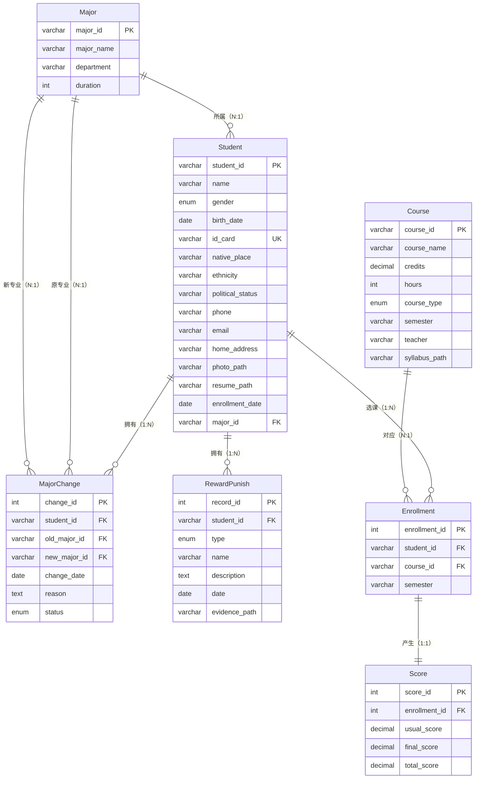

**实体间关系汇总：**

| 父实体 | 关系名 | 子实体 | 基数 | 外键 |
|--------|--------|--------|------|------|
| Major | 所属 | Student | N:1 | Student.major_id |
| Student | 拥有 | MajorChange | 1:N | MajorChange.student_id |
| Major | 原专业 | MajorChange | N:1 | MajorChange.old_major_id |
| Major | 新专业 | MajorChange | N:1 | MajorChange.new_major_id |
| Student | 拥有 | RewardPunish | 1:N | RewardPunish.student_id |
| Student | 选课 | Enrollment | 1:N | Enrollment.student_id |
| Course | 对应 | Enrollment | N:1 | Enrollment.course_id |
| Enrollment | 产生 | Score | 1:1 | Score.enrollment_id (UNIQUE) |

### 1.3 数据库模式设计

> 数据库名称：`student_management`，字符集：`utf8mb4`，引擎：`InnoDB`。共 8 张表（7 张业务表 + 1 张系统表）。

#### 1.3.1 专业表 (Major)

| 字段名 | 类型 | 约束 | 说明 |
|--------|------|------|------|
| major_id | VARCHAR(20) | PRIMARY KEY | 专业编号 |
| major_name | VARCHAR(100) | NOT NULL | 专业名称 |
| department | VARCHAR(100) | NOT NULL | 所属院系 |
| duration | INT | DEFAULT 4 | 学制（年） |

```sql
CREATE TABLE Major (
    major_id    VARCHAR(20) PRIMARY KEY COMMENT '专业编号',
    major_name  VARCHAR(100) NOT NULL COMMENT '专业名称',
    department  VARCHAR(100) NOT NULL COMMENT '所属院系',
    duration    INT DEFAULT 4 COMMENT '学制（年）'
) ENGINE=InnoDB DEFAULT CHARSET=utf8mb4 COMMENT='专业表';
```

#### 1.3.2 学生表 (Student)

| 字段名 | 类型 | 约束 | 说明 |
|--------|------|------|------|
| student_id | VARCHAR(20) | PRIMARY KEY | 学号 |
| name | VARCHAR(50) | NOT NULL | 姓名 |
| gender | ENUM('男','女') | NOT NULL | 性别 |
| birth_date | DATE | | 出生日期 |
| id_card | VARCHAR(18) | UNIQUE | 身份证号 |
| native_place | VARCHAR(100) | | 籍贯 |
| ethnicity | VARCHAR(50) | | 民族 |
| political_status | VARCHAR(50) | | 政治面貌 |
| phone | VARCHAR(20) | | 联系电话 |
| email | VARCHAR(100) | | 邮箱 |
| home_address | VARCHAR(255) | | 家庭地址 |
| photo_path | VARCHAR(255) | | 照片存储路径 |
| resume_path | VARCHAR(255) | | 简历存储路径 |
| enrollment_date | DATE | | 入学日期 |
| major_id | VARCHAR(20) | FK → Major | 当前专业ID |
| is_deleted | TINYINT(1) | DEFAULT 0 | 软删除标记 |

```sql
CREATE TABLE Student (
    student_id       VARCHAR(20) PRIMARY KEY COMMENT '学号',
    name             VARCHAR(50) NOT NULL COMMENT '姓名',
    gender           ENUM('男','女') NOT NULL COMMENT '性别',
    birth_date       DATE COMMENT '出生日期',
    id_card          VARCHAR(18) UNIQUE COMMENT '身份证号',
    native_place     VARCHAR(100) COMMENT '籍贯',
    ethnicity        VARCHAR(50) COMMENT '民族',
    political_status VARCHAR(50) COMMENT '政治面貌',
    phone            VARCHAR(20) COMMENT '联系电话',
    email            VARCHAR(100) COMMENT '邮箱',
    home_address     VARCHAR(255) COMMENT '家庭地址',
    photo_path       VARCHAR(255) COMMENT '照片存储路径',
    resume_path      VARCHAR(255) COMMENT '简历存储路径',
    enrollment_date  DATE COMMENT '入学日期',
    major_id         VARCHAR(20) COMMENT '当前专业ID',
    is_deleted       TINYINT(1) DEFAULT 0 COMMENT '软删除标记 0=正常 1=已删除',
    FOREIGN KEY (major_id) REFERENCES Major(major_id)
        ON DELETE SET NULL ON UPDATE CASCADE
) ENGINE=InnoDB DEFAULT CHARSET=utf8mb4 COMMENT='学生表';
```

> **多媒体字段说明：** `photo_path` 存储学生证件照片的文件路径（支持 jpg/png），`resume_path` 存储简历附件路径（支持 pdf/doc/docx）。文件存储在 `static/uploads/` 目录下，文件名以学号为前缀防止覆盖。

#### 1.3.3 专业变更记录表 (MajorChange)

| 字段名 | 类型 | 约束 | 说明 |
|--------|------|------|------|
| change_id | INT | PK, AUTO_INCREMENT | 变更ID |
| student_id | VARCHAR(20) | FK → Student, NOT NULL | 学号 |
| old_major_id | VARCHAR(20) | FK → Major | 原专业ID |
| new_major_id | VARCHAR(20) | FK → Major, NOT NULL | 新专业ID |
| change_date | DATE | NOT NULL | 变更日期 |
| reason | TEXT | | 变更原因 |
| status | ENUM('待审批','已通过','已驳回') | DEFAULT '待审批' | 审批状态 |

```sql
CREATE TABLE MajorChange (
    change_id     INT AUTO_INCREMENT PRIMARY KEY COMMENT '变更ID',
    student_id    VARCHAR(20) NOT NULL COMMENT '学号',
    old_major_id  VARCHAR(20) COMMENT '原专业ID',
    new_major_id  VARCHAR(20) NOT NULL COMMENT '新专业ID',
    change_date   DATE NOT NULL COMMENT '变更日期',
    reason        TEXT COMMENT '变更原因',
    status        ENUM('待审批','已通过','已驳回') DEFAULT '待审批' COMMENT '审批状态',
    FOREIGN KEY (student_id) REFERENCES Student(student_id)
        ON DELETE CASCADE ON UPDATE CASCADE,
    FOREIGN KEY (old_major_id) REFERENCES Major(major_id)
        ON DELETE SET NULL ON UPDATE CASCADE,
    FOREIGN KEY (new_major_id) REFERENCES Major(major_id)
        ON DELETE CASCADE ON UPDATE CASCADE
) ENGINE=InnoDB DEFAULT CHARSET=utf8mb4 COMMENT='专业变更记录表';
```

#### 1.3.4 奖惩记录表 (RewardPunish)

| 字段名 | 类型 | 约束 | 说明 |
|--------|------|------|------|
| record_id | INT | PK, AUTO_INCREMENT | 记录ID |
| student_id | VARCHAR(20) | FK → Student, NOT NULL | 学号 |
| type | ENUM('奖励','惩罚') | NOT NULL | 类型 |
| name | VARCHAR(200) | NOT NULL | 奖惩名称 |
| description | TEXT | | 描述 |
| date | DATE | NOT NULL | 奖惩日期 |
| evidence_path | VARCHAR(500) | | 证明材料路径（多文件逗号分隔） |

```sql
CREATE TABLE RewardPunish (
    record_id      INT AUTO_INCREMENT PRIMARY KEY COMMENT '记录ID',
    student_id     VARCHAR(20) NOT NULL COMMENT '学号',
    type           ENUM('奖励','惩罚') NOT NULL COMMENT '类型',
    name           VARCHAR(200) NOT NULL COMMENT '奖惩名称',
    description    TEXT COMMENT '描述',
    date           DATE NOT NULL COMMENT '奖惩日期',
    evidence_path  VARCHAR(500) COMMENT '证明材料路径（支持多文件，逗号分隔）',
    FOREIGN KEY (student_id) REFERENCES Student(student_id)
        ON DELETE CASCADE ON UPDATE CASCADE
) ENGINE=InnoDB DEFAULT CHARSET=utf8mb4 COMMENT='奖惩记录表';
```

> **多媒体说明：** `evidence_path` 支持存储多个文件路径（逗号分隔），可同时上传图片（jpg/png）、视频（mp4）、文档（pdf/doc/docx）三类证明材料。

#### 1.3.5 课程表 (Course)

| 字段名 | 类型 | 约束 | 说明 |
|--------|------|------|------|
| course_id | VARCHAR(20) | PRIMARY KEY | 课程编号 |
| course_name | VARCHAR(100) | NOT NULL | 课程名称 |
| credits | DECIMAL(3,1) | NOT NULL | 学分 |
| hours | INT | NOT NULL | 总学时 |
| course_type | ENUM('必修','选修','公选') | NOT NULL | 课程类型 |
| semester | VARCHAR(20) | | 开课学期 |
| teacher | VARCHAR(50) | | 授课教师 |
| syllabus_path | VARCHAR(255) | | 教学大纲文件路径 |
| material_path | VARCHAR(500) | | 教学资料路径（多文件） |
| description | TEXT | | 课程描述/备注 |

```sql
CREATE TABLE Course (
    course_id      VARCHAR(20) PRIMARY KEY COMMENT '课程编号',
    course_name    VARCHAR(100) NOT NULL COMMENT '课程名称',
    credits        DECIMAL(3,1) NOT NULL COMMENT '学分',
    hours          INT NOT NULL COMMENT '总学时',
    course_type    ENUM('必修','选修','公选') NOT NULL COMMENT '课程类型',
    semester       VARCHAR(20) COMMENT '开课学期',
    teacher        VARCHAR(50) COMMENT '授课教师',
    syllabus_path  VARCHAR(255) COMMENT '教学大纲文件路径',
    material_path  VARCHAR(500) COMMENT '教学资料路径（多文件逗号分隔）',
    description    TEXT COMMENT '课程描述/备注'
) ENGINE=InnoDB DEFAULT CHARSET=utf8mb4 COMMENT='课程表';
```

> **多媒体说明：** `syllabus_path` 存储教学大纲文件（pdf/doc/docx），`material_path` 存储教学资料（支持多文件，逗号分隔）。

#### 1.3.6 选课记录表 (Enrollment)

| 字段名 | 类型 | 约束 | 说明 |
|--------|------|------|------|
| enrollment_id | INT | PK, AUTO_INCREMENT | 选课ID |
| student_id | VARCHAR(20) | FK → Student, NOT NULL | 学号 |
| course_id | VARCHAR(20) | FK → Course, NOT NULL | 课程编号 |
| semester | VARCHAR(20) | NOT NULL | 选课学期 |

```sql
CREATE TABLE Enrollment (
    enrollment_id  INT AUTO_INCREMENT PRIMARY KEY COMMENT '选课ID',
    student_id     VARCHAR(20) NOT NULL COMMENT '学号',
    course_id      VARCHAR(20) NOT NULL COMMENT '课程编号',
    semester       VARCHAR(20) NOT NULL COMMENT '选课学期',
    UNIQUE KEY uk_student_course_sem (student_id, course_id, semester),
    FOREIGN KEY (student_id) REFERENCES Student(student_id)
        ON DELETE CASCADE ON UPDATE CASCADE,
    FOREIGN KEY (course_id) REFERENCES Course(course_id)
        ON DELETE CASCADE ON UPDATE CASCADE
) ENGINE=InnoDB DEFAULT CHARSET=utf8mb4 COMMENT='选课记录表';
```

> **设计要点：** UNIQUE 约束 `(student_id, course_id, semester)` 确保同一学生不会在同一学期重复选择同一门课程。

#### 1.3.7 成绩表 (Score)

| 字段名 | 类型 | 约束 | 说明 |
|--------|------|------|------|
| score_id | INT | PK, AUTO_INCREMENT | 成绩ID |
| enrollment_id | INT | FK → Enrollment, UNIQUE | 选课ID（一对一） |
| usual_score | DECIMAL(5,2) | DEFAULT 0 | 平时成绩 |
| final_score | DECIMAL(5,2) | DEFAULT 0 | 期末成绩 |
| total_score | DECIMAL(5,2) | DEFAULT 0 | 总评成绩 |

```sql
CREATE TABLE Score (
    score_id       INT AUTO_INCREMENT PRIMARY KEY COMMENT '成绩ID',
    enrollment_id  INT NOT NULL UNIQUE COMMENT '选课ID（一对一）',
    usual_score    DECIMAL(5,2) DEFAULT 0 COMMENT '平时成绩',
    final_score    DECIMAL(5,2) DEFAULT 0 COMMENT '期末成绩',
    total_score    DECIMAL(5,2) DEFAULT 0 COMMENT '总评成绩 = 平时*0.4 + 期末*0.6',
    FOREIGN KEY (enrollment_id) REFERENCES Enrollment(enrollment_id)
        ON DELETE CASCADE ON UPDATE CASCADE
) ENGINE=InnoDB DEFAULT CHARSET=utf8mb4 COMMENT='成绩表';
```

> **关键设计：** `enrollment_id` 具有 UNIQUE 约束，确保 Enrollment 与 Score 之间的一对一关系。`total_score` 由触发器自动计算，无需应用层手动计算。

#### 1.3.8 管理员表 (Admin)

| 字段名 | 类型 | 约束 | 说明 |
|--------|------|------|------|
| admin_id | INT | PK, AUTO_INCREMENT | 管理员ID |
| username | VARCHAR(50) | NOT NULL, UNIQUE | 用户名 |
| password_hash | VARCHAR(255) | NOT NULL | 密码哈希值（SHA-256） |
| created_at | TIMESTAMP | DEFAULT CURRENT_TIMESTAMP | 创建时间 |

```sql
CREATE TABLE Admin (
    admin_id      INT AUTO_INCREMENT PRIMARY KEY COMMENT '管理员ID',
    username      VARCHAR(50) NOT NULL UNIQUE COMMENT '用户名',
    password_hash VARCHAR(255) NOT NULL COMMENT '密码哈希值',
    created_at    TIMESTAMP DEFAULT CURRENT_TIMESTAMP COMMENT '创建时间'
) ENGINE=InnoDB DEFAULT CHARSET=utf8mb4 COMMENT='管理员表';
```

> **安全设计：** Admin 表独立于业务实体，不参与业务关系。密码使用 SHA-256 哈希存储，不保存明文。

### 1.4 3NF 合规说明

全部 **7 个业务实体**（不含管理员表）均满足第三范式（3NF）：

| 实体 | 3NF 分析 |
|------|----------|
| **Student** | 所有非主属性完全函数依赖于 `student_id`。`major_id` 是外键，直接引用 Major 表，不存在传递依赖。 |
| **MajorChange** | 完全函数依赖于 `change_id`。`old_major_id` 和 `new_major_id` 直接引用 Major 表，非传递依赖。 |
| **RewardPunish** | 完全函数依赖于 `record_id`。所有非主属性描述该条奖惩记录本身。 |
| **Course** | 完全函数依赖于 `course_id`。`teacher` 仅为字符串属性，不独立构成教师实体，不存在部分依赖。 |
| **Enrollment** | 完全函数依赖于 `enrollment_id`。`(student_id, course_id, semester)` 的 UNIQUE 约束是业务规则，非主键依赖关系。 |
| **Score** | 完全函数依赖于 `score_id`。`enrollment_id` 为 UNIQUE 外键，`total_score` 由触发器自动计算，不存储冗余数据。 |
| **Admin** | 独立认证实体，不参与业务关系。完全函数依赖于 `admin_id`。 |

**不存在部分依赖和传递依赖**，未进行任何反范式化设计。

---

## 2. 实现说明

### 2.1 系统架构

```
┌─────────────────────────────────────────────────┐
│                   浏览器 (Browser)                │
│         HTML5 + Bootstrap 5 + JavaScript         │
└─────────────────────┬───────────────────────────┘
                      │ HTTP Request / Response
┌─────────────────────┴───────────────────────────┐
│              Flask Web 应用 (Python 3)            │
│                                                   │
│  ┌──────────┐ ┌──────────┐ ┌──────────────────┐  │
│  │  auth    │ │ student  │ │ reward_punish    │  │
│  │  Blueprint│ │ Blueprint│ │ Blueprint        │  │
│  └──────────┘ └──────────┘ └──────────────────┘  │
│  ┌──────────┐ ┌──────────┐ ┌──────────────────┐  │
│  │  major   │ │  course  │ │  score           │  │
│  │  Blueprint│ │ Blueprint│ │  Blueprint        │  │
│  └──────────┘ └──────────┘ └──────────────────┘  │
│                                                   │
│  ┌────────────────────────────────────────────┐  │
│  │           database_helper.py                │  │
│  │  (query / callproc / insert_return_id)      │  │
│  └────────────────────────────────────────────┘  │
└─────────────────────┬───────────────────────────┘
                      │ PyMySQL
┌─────────────────────┴───────────────────────────┐
│              MySQL 8.0 (student_management)       │
│  ┌────────┐ ┌──────────┐ ┌──────────┐           │
│  │ Tables │ │ Triggers │ │ Procedures│           │
│  │ (8)    │ │ (3)      │ │ (2)      │           │
│  └────────┘ └──────────┘ └──────────┘           │
│  ┌────────────┐ ┌──────────────────┐            │
│  │ Functions  │ │ Transactions     │            │
│  │ (2)        │ │ (3 事务示例)     │            │
│  └────────────┘ └──────────────────┘            │
└─────────────────────────────────────────────────┘
```

**技术栈：**

| 层次 | 技术 |
|------|------|
| 前端 | HTML5 + Bootstrap 5.3 + Bootstrap Icons + Jinja2 模板引擎 |
| 后端 | Python 3 + Flask（轻量级微框架） |
| 数据库连接 | PyMySQL（纯 Python MySQL 驱动） |
| 数据库 | MySQL 8.0（InnoDB 引擎，utf8mb4 字符集） |
| 文件存储 | 本地文件系统（`static/uploads/`） |

**设计模式与特点：**

- **模块化路由**：使用 Flask Blueprint 将系统拆分为 6 个独立功能模块（auth、student、major、reward_punish、course、score/enrollment），每个模块内聚度高、耦合度低
- **数据库操作封装**：`database_helper.py` 统一封装连接管理、查询、事务、存储过程调用，提供 `query()`、`insert_return_id()`、`callproc()`、`transaction()` 四个核心函数
- **计算逻辑下推**：将总评成绩计算（触发器）、GPA 计算（存储过程）、排名查询（存储过程）等计算密集型逻辑放在数据库层执行，减轻应用层负担
- **安全防护**：密码哈希存储（SHA-256）、文件名校验（`secure_filename`）、文件类型白名单、参数化查询防 SQL 注入

### 2.2 项目目录结构

```
lab2/
├── app.py                    # Flask 应用入口，注册 Blueprint，根路由重定向
├── config.py                 # 数据库配置、SECRET_KEY、上传目录、文件类型白名单
├── database_helper.py        # 数据库操作封装（query / callproc / insert_return_id / transaction）
├── init_db.py                # 数据库一键初始化脚本（执行所有 SQL 文件）
├── test_import.py            # 导入测试脚本
├── database/
│   ├── init.sql              # DDL：8 张表的建表语句
│   ├── functions.sql         # 2 个自定义函数（fn_avg_score / fn_course_count）
│   ├── procedures.sql        # 2 个存储过程（sp_calc_gpa / sp_rank_by_course）
│   ├── triggers.sql          # 3 个触发器（成绩自动计算×2 + 专业变更同步）
│   ├── transactions.sql      # 3 个事务示例
│   └── seed.sql              # 种子测试数据
├── blueprints/
│   ├── __init__.py
│   ├── auth.py               # 登录/登出、管理员 CRUD、密码修改
│   ├── student.py            # 学生 CRUD、照片/简历上传下载、分页搜索
│   ├── major.py              # 专业 CRUD、专业变更管理、变更统计
│   ├── reward_punish.py      # 奖惩 CRUD、图片/视频/文件上传下载
│   ├── course.py             # 课程 CRUD、教学大纲/资料上传下载
│   ├── score.py              # 成绩录入/修改、选课管理、GPA/排名/统计
│   └── enrollment.py         # 选课记录管理
├── templates/
│   ├── base.html             # 基础模板（导航栏 + 侧边栏 + Bootstrap 样式）
│   ├── login.html            # 登录页
│   ├── change_password.html  # 修改密码
│   ├── admin_list.html       # 管理员列表
│   ├── student_list.html     # 学生列表（分页 + 搜索 + 排序）
│   ├── student_create.html   # 添加学生（含照片/简历上传）
│   ├── student_edit.html     # 编辑学生
│   ├── student_view.html     # 学生详情（含多媒体查看/下载）
│   ├── major_list.html       # 专业列表
│   ├── major_change_list.html    # 专业变更记录列表
│   ├── major_change_stats.html   # 专业变更统计（转入/转出）
│   ├── rp_list.html          # 奖惩列表（含材料预览/播放/下载）
│   ├── rp_create.html        # 添加奖惩（含多媒体上传）
│   ├── rp_edit.html          # 编辑奖惩
│   ├── course_list.html      # 课程列表（含大纲/资料上传下载）
│   ├── enrollment_list.html  # 选课记录管理
│   ├── score_list.html       # 成绩管理（录入/查询/修改）
│   ├── score_gpa.html        # GPA 统计（存储过程 + 函数）
│   ├── score_rank.html       # 成绩排名（按课程，存储过程）
│   └── score_stats.html      # 分数分布统计
└── static/
    └── uploads/              # 上传文件存储目录
```

### 2.3 核心代码解析

#### 2.3.1 应用入口（app.py）— Blueprint 模块化路由

```python
from flask import Flask, redirect, url_for
from config import SECRET_KEY, UPLOAD_FOLDER
import os

app = Flask(__name__)
app.secret_key = SECRET_KEY
app.config['UPLOAD_FOLDER'] = UPLOAD_FOLDER
os.makedirs(UPLOAD_FOLDER, exist_ok=True)

# 注册 7 个 Blueprint 模块
from blueprints.auth import auth_bp
from blueprints.student import student_bp
from blueprints.major import major_bp
from blueprints.reward_punish import rp_bp
from blueprints.course import course_bp
from blueprints.score import score_bp
from blueprints.enrollment import enrollment_bp

app.register_blueprint(auth_bp, url_prefix='/auth')
app.register_blueprint(student_bp, url_prefix='/student')
app.register_blueprint(major_bp, url_prefix='/major')
app.register_blueprint(rp_bp, url_prefix='/rp')
app.register_blueprint(course_bp, url_prefix='/course')
app.register_blueprint(score_bp, url_prefix='/score')
app.register_blueprint(enrollment_bp, url_prefix='/enrollment')

@app.route('/')
def index():
    return redirect(url_for('auth.login'))
```

> **设计要点：** 使用 Flask Blueprint 实现模块化路由，每个功能模块独立注册，互不干扰。根路径 `/` 自动重定向到登录页。应用启动时自动创建上传目录。

#### 2.3.2 数据库操作封装（database_helper.py）— 统一数据访问层

```python
import pymysql
from config import DB_CONFIG
import contextlib

def get_connection():
    """获取数据库连接"""
    return pymysql.connect(**DB_CONFIG)

def query(sql, params=None, fetchone=False, fetchall=False):
    """执行SQL查询
    - fetchone=True: 返回单行
    - fetchall=True: 返回全部行
    - 否则执行写操作并 commit
    """
    conn = get_connection()
    try:
        with conn.cursor() as cur:
            cur.execute(sql, params or ())
            if fetchone:
                return cur.fetchone()
            if fetchall:
                return cur.fetchall()
            conn.commit()
            return cur.lastrowid
    except Exception as e:
        conn.rollback()
        raise e
    finally:
        conn.close()

def insert_return_id(sql, params=None):
    """在同一连接中执行INSERT并返回LAST_INSERT_ID
    解决跨连接时 lastrowid 失效的问题"""
    conn = get_connection()
    try:
        with conn.cursor() as cur:
            cur.execute(sql, params or ())
            eid = cur.lastrowid
            conn.commit()
            return eid
    except Exception as e:
        conn.rollback()
        raise e
    finally:
        conn.close()

def callproc(proc_name, args=(), fetch_result=False):
    """调用存储过程
    - fetch_result=True: 返回结果集（如排名查询）
    - 否则获取 OUT 参数值（如 GPA 计算）
    """
    conn = get_connection()
    try:
        with conn.cursor() as cur:
            if fetch_result:
                cur.callproc(proc_name, args)
                result = cur.fetchall()
                conn.commit()
                return result
            else:
                cur.callproc(proc_name, args)
                conn.commit()
                cur.execute(f'SELECT @_{proc_name}_1')
                return cur.fetchone()
    except Exception as e:
        conn.rollback()
        raise e
    finally:
        conn.close()
```

> **关键设计：** 
> - `query()` 函数支持三种模式：fetchone（单行查询）、fetchall（多行查询）、写操作（自动 commit），统一了 CRUD 操作接口
> - `insert_return_id()` 在**同一连接**内完成 INSERT 并返回自增 ID，避免了跨连接时 `lastrowid` 失效导致的外键约束错误
> - `callproc()` 支持两种存储过程调用模式：返回结果集（如排名查询）和 OUT 参数（如 GPA 计算），覆盖了不同场景
> - 所有函数均包含 `try-except-finally` 异常处理和回滚机制，确保数据安全

#### 2.3.3 成绩录入核心流程 — 验证 → 选课 → 插入 → 触发器计算

```python
@score_bp.route('/create', methods=['POST'])
def create():
    # ... 登录检查 ...
    sid = request.form.get('student_id', '')
    cid = request.form.get('course_id', '')
    usual = request.form.get('usual_score', 0)
    final = request.form.get('final_score', 0)
    sem = request.form.get('semester', '')

    # 步骤1：验证学生和课程存在性
    student = query(
        'SELECT student_id FROM Student WHERE student_id=%s AND is_deleted=0',
        (sid,), fetchone=True)
    if not student:
        flash(f'学号 {sid} 不存在或已被删除')
        return redirect(url_for('score.list'))
    course = query(
        'SELECT course_id FROM Course WHERE course_id=%s',
        (cid,), fetchone=True)
    if not course:
        flash(f'课程编号 {cid} 不存在')
        return redirect(url_for('score.list'))

    # 步骤2：查找或自动创建选课记录
    enroll = query(
        'SELECT enrollment_id FROM Enrollment '
        'WHERE student_id=%s AND course_id=%s AND semester=%s',
        (sid, cid, sem), fetchone=True)
    if not enroll:
        eid = insert_return_id(
            'INSERT INTO Enrollment (student_id, course_id, semester) '
            'VALUES (%s,%s,%s)', (sid, cid, sem))
    else:
        eid = enroll[0]

    # 步骤3：检查是否已有成绩（一对一约束）
    existing = query(
        'SELECT score_id FROM Score WHERE enrollment_id=%s',
        (eid,), fetchone=True)
    if existing:
        flash('该学生此课程已有成绩，请使用编辑功能')
    else:
        # 步骤4：插入成绩 → 触发器自动计算 total_score
        query(
            'INSERT INTO Score (enrollment_id, usual_score, final_score) '
            'VALUES (%s,%s,%s)', (eid, usual, final))
        flash('成绩录入成功（总评已自动计算）')
    return redirect(url_for('score.list'))
```

> **流程说明：** 整个过程体现了数据库设计的完整性约束优势——输入验证确保数据存在性，UNIQUE 约束防止重复选课和重复评分，触发器自动计算总评，保证了一致性和正确性。

#### 2.3.4 文件上传实现 — 多类型白名单 + 安全防护

```python
from config import UPLOAD_FOLDER, ALLOWED_IMAGE_EXTENSIONS, \
    ALLOWED_VIDEO_EXTENSIONS, ALLOWED_DOC_EXTENSIONS
from werkzeug.utils import secure_filename

def allowed_file(filename, allowed_set):
    """检查文件扩展名是否在白名单中"""
    return '.' in filename and \
        filename.rsplit('.', 1)[1].lower() in allowed_set

# 在 rewards/punish 创建路由中的文件处理：
paths = []
for field in ['evidence_image', 'evidence_video', 'evidence_file']:
    if field in request.files:
        for file in request.files.getlist(field):
            if file and file.filename:
                ext = file.filename.rsplit('.', 1)[-1].lower()
                # 根据字段名选择对应的扩展名白名单
                if 'image' in field:
                    allowed = ALLOWED_IMAGE_EXTENSIONS
                elif 'video' in field:
                    allowed = ALLOWED_VIDEO_EXTENSIONS
                else:
                    allowed = ALLOWED_DOC_EXTENSIONS

                if ext in allowed:
                    # 安全处理文件名：防止路径遍历攻击
                    fn = secure_filename(f'{sid}_{file.filename}')
                    file.save(os.path.join(UPLOAD_FOLDER, fn))
                    paths.append('uploads/' + fn)

# 多文件路径用逗号分隔存储
evidence = ','.join(paths) if paths else None
```

> **安全要点：**
> - **白名单机制**：`ALLOWED_IMAGE_EXTENSIONS = {'jpg', 'jpeg', 'png', 'gif', 'bmp'}`，只允许特定扩展名
> - **文件名清洗**：`secure_filename()` 过滤路径分隔符和危险字符，防止路径遍历攻击
> - **文件命名**：以 `{学号}_{原始文件名}` 格式命名，既保证可读性又防止文件覆盖
> - **多文件支持**：`request.files.getlist(field)` 支持同一字段上传多个文件
> - **路径存储**：多个文件路径以逗号分隔存储在 `evidence_path` / `material_path` 字段中

### 2.4 数据库对象实现

> 本系统完整实现了 **存储过程、函数、触发器、事务** 四类数据库对象，且均针对系统实际需求设计，满足课程验收要求。

#### 2.4.1 存储过程 (Stored Procedures)

**SP-01：计算学生 GPA (`sp_calc_gpa`)**

```sql
CREATE PROCEDURE sp_calc_gpa(
    IN p_student_id VARCHAR(20),
    OUT p_gpa DECIMAL(4,2)
)
READS SQL DATA
BEGIN
    DECLARE total_weighted DECIMAL(10,4) DEFAULT 0;
    DECLARE total_credits DECIMAL(10,1) DEFAULT 0;

    -- 计算加权 GPA：Σ(学分 × 绩点) / Σ(学分)
    -- 绩点 = 总评成绩/100 × 4.0（百分制转 4.0 制）
    SELECT SUM(c.credits * (sc.total_score / 100.0 * 4.0)),
           SUM(c.credits)
    INTO total_weighted, total_credits
    FROM Score sc
    JOIN Enrollment e ON sc.enrollment_id = e.enrollment_id
    JOIN Course c ON e.course_id = c.course_id
    WHERE e.student_id = p_student_id;

    IF total_credits > 0 THEN
        SET p_gpa = total_weighted / total_credits;
    ELSE
        SET p_gpa = 0;
    END IF;
END
```

> **功能：** 输入学号，通过 OUT 参数返回加权平均 GPA。公式：Σ(学分 × 绩点) / Σ(学分)，绩点 = 总评成绩/100 × 4.0。GPA 统计页面遍历所有学生调用此存储过程，通过 `callproc('sp_calc_gpa', (sid,))` 获取 `@_sp_calc_gpa_1` 变量值。

**SP-02：课程成绩排名 (`sp_rank_by_course`)**

```sql
CREATE PROCEDURE sp_rank_by_course(IN p_course_id VARCHAR(20))
READS SQL DATA
BEGIN
    SELECT e.student_id, s.name AS student_name,
           sc.total_score,
           RANK() OVER (ORDER BY sc.total_score DESC) AS course_rank
    FROM Score sc
    JOIN Enrollment e ON sc.enrollment_id = e.enrollment_id
    JOIN Student s ON e.student_id = s.student_id
    WHERE e.course_id = p_course_id AND s.is_deleted = 0
    ORDER BY sc.total_score DESC;
END
```

> **功能：** 输入课程编号，返回该课程所有学生的成绩排名表。使用 MySQL 8.0 `RANK()` 窗口函数处理并列排名（同分同名次，后续名次跳跃）。通过 `callproc('sp_rank_by_course', (cid,), fetch_result=True)` 直接获取结果集在前端渲染。

#### 2.4.2 函数 (Functions)

**FN-01：学生平均成绩 (`fn_avg_score`)**

```sql
CREATE FUNCTION fn_avg_score(p_student_id VARCHAR(20))
RETURNS DECIMAL(5,2)
READS SQL DATA DETERMINISTIC
BEGIN
    DECLARE avg_sc DECIMAL(5,2) DEFAULT 0;
    SELECT AVG(sc.total_score) INTO avg_sc
    FROM Score sc
    JOIN Enrollment e ON sc.enrollment_id = e.enrollment_id
    WHERE e.student_id = p_student_id;
    RETURN IFNULL(avg_sc, 0);
END
```

> **功能：** 输入学号，返回该学生所有课程的平均成绩。在 GPA 统计页面通过 SQL `SELECT fn_avg_score(student_id)` 直接调用。

**FN-02：学生选课数 (`fn_course_count`)**

```sql
CREATE FUNCTION fn_course_count(p_student_id VARCHAR(20))
RETURNS INT
READS SQL DATA DETERMINISTIC
BEGIN
    DECLARE cnt INT DEFAULT 0;
    SELECT COUNT(DISTINCT e.course_id) INTO cnt
    FROM Enrollment e WHERE e.student_id = p_student_id;
    RETURN cnt;
END
```

> **功能：** 输入学号，返回该学生已选课程数量（去重）。与 `fn_avg_score` 配合使用，在 GPA 统计页面同时展示每位学生的平均分和课程数。

#### 2.4.3 触发器 (Triggers)

**TRG-01/02：成绩自动计算总评**

```sql
-- INSERT 时自动计算
CREATE TRIGGER trg_score_auto_calc BEFORE INSERT ON Score
FOR EACH ROW
BEGIN
    SET NEW.total_score = NEW.usual_score * 0.4 + NEW.final_score * 0.6;
END;

-- UPDATE 时自动重算
CREATE TRIGGER trg_score_update_calc BEFORE UPDATE ON Score
FOR EACH ROW
BEGIN
    SET NEW.total_score = NEW.usual_score * 0.4 + NEW.final_score * 0.6;
END;
```

> **功能：** 在成绩 INSERT 和 UPDATE 时，自动根据平时成绩（×40%）+ 期末成绩（×60%）计算总评成绩。应用层无需手动计算 `total_score`，计算逻辑集中在数据库层，保证一致性和可维护性。

**TRG-03：专业变更审批同步**

```sql
CREATE TRIGGER trg_major_change_sync AFTER UPDATE ON MajorChange
FOR EACH ROW
BEGIN
    -- 当审批状态变为"已通过"时，自动更新学生当前专业
    IF NEW.status = '已通过' AND OLD.status != '已通过' THEN
        UPDATE Student
        SET major_id = NEW.new_major_id
        WHERE student_id = NEW.student_id;
    END IF;
END
```

> **功能：** 当专业变更记录的审批状态从其他状态变为"已通过"时，自动将 Student 表的 `major_id` 同步更新为新专业。避免了审批后手动修改学生信息的繁琐操作，确保数据自动一致。

#### 2.4.4 事务机制 (Transactions)

系统在应用层使用 `database_helper.py` 中的自动回滚机制保证事务性：

```python
def query(sql, params=None, fetchone=False, fetchall=False):
    conn = get_connection()
    try:
        with conn.cursor() as cur:
            # ... 执行 SQL ...
            conn.commit()
    except Exception as e:
        conn.rollback()  # 异常自动回滚
        raise e
    finally:
        conn.close()
```

**事务示例 — 专业变更（TX-01）：**

```sql
START TRANSACTION;
    -- 插入变更记录
    INSERT INTO MajorChange (student_id, old_major_id, new_major_id,
                             change_date, reason, status)
    VALUES ('S2024001', 'CS', 'SE', CURDATE(), '个人兴趣转移', '已通过');

    -- 同步更新学生当前专业
    UPDATE Student SET major_id = 'SE'
    WHERE student_id = 'S2024001';
COMMIT;
-- ROLLBACK;  -- 若任一操作失败，所有操作回滚
```

> **说明：** 事务确保"插入变更记录"和"更新学生专业"两个操作要么同时成功，要么同时失败，防止数据不一致。

**事务示例 — 批量成绩录入（TX-02）：**

```sql
START TRANSACTION;
    -- 创建选课记录（若已存在则跳过）
    INSERT INTO Enrollment (student_id, course_id, semester)
    VALUES ('S2024002', 'CS101', '2026春')
    ON DUPLICATE KEY UPDATE enrollment_id = enrollment_id;

    -- 获取选课ID并插入成绩
    SET @eid1 = (SELECT enrollment_id FROM Enrollment
                 WHERE student_id='S2024002' AND course_id='CS101'
                 AND semester='2026春');
    INSERT INTO Score (enrollment_id, usual_score, final_score)
    VALUES (@eid1, 85, 90)
    ON DUPLICATE KEY UPDATE usual_score = 85, final_score = 90;
COMMIT;
```

> **说明：** 使用 `ON DUPLICATE KEY UPDATE` 处理选课/成绩可能已存在的场景，事务保证批量操作的原子性。

---

## 3. 结果展示

> 以下为系统主要功能的运行截图占位。请自行截图粘贴替换。

### 3.1 登录页面

<!-- TODO: 请粘贴登录页截图 -->
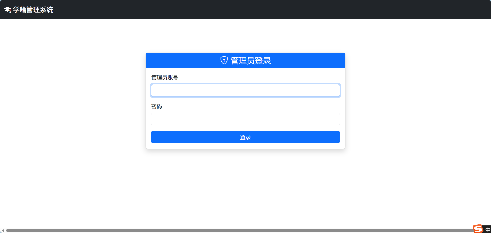

### 3.2 学生管理 — 列表页（分页 + 搜索 + 排序）

<!-- TODO: 请粘贴学生列表截图 -->
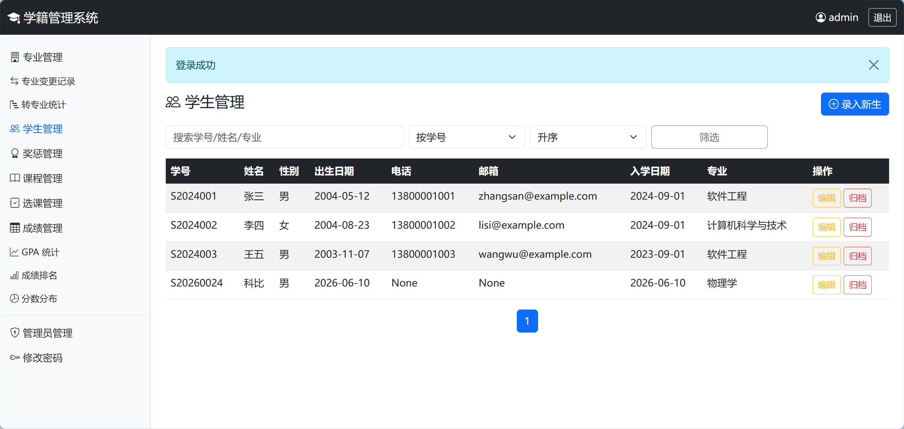

### 3.3 学生管理 — 添加/编辑学生（含照片和简历上传）

<!-- TODO: 请粘贴学生编辑截图 -->
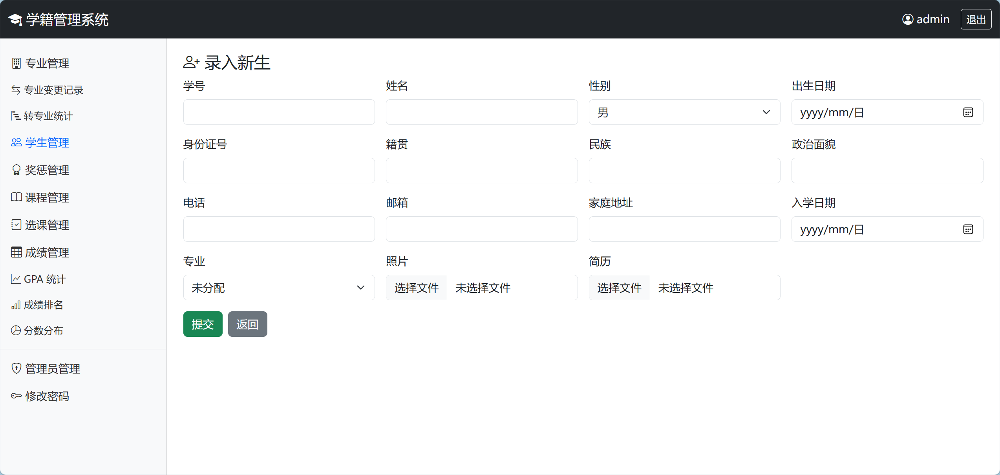

### 3.4 学生管理 — 详情页（含照片查看 + 简历下载）

<!-- TODO: 请粘贴学生详情截图 -->
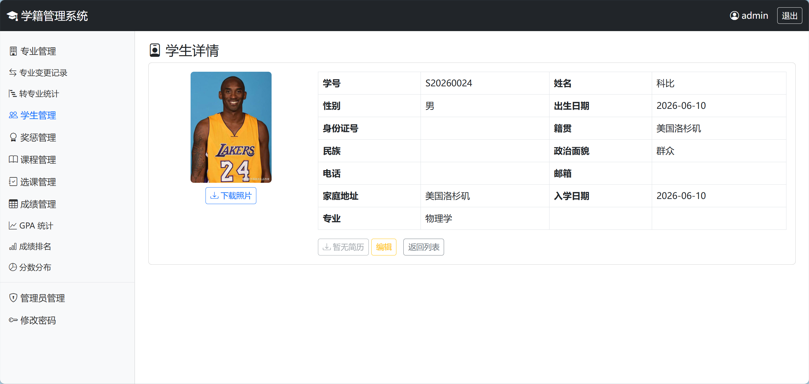

### 3.5 专业管理 — 专业列表

<!-- TODO: 请粘贴专业列表截图 -->
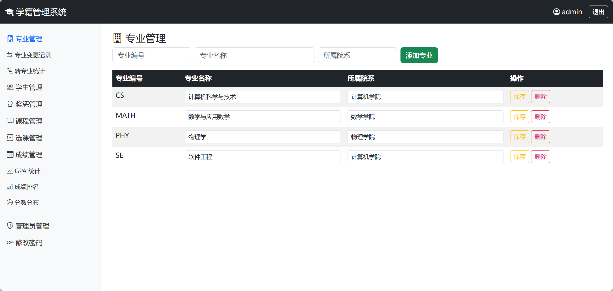

### 3.6 专业变更管理 — 变更记录与审批

<!-- TODO: 请粘贴专业变更列表截图 -->
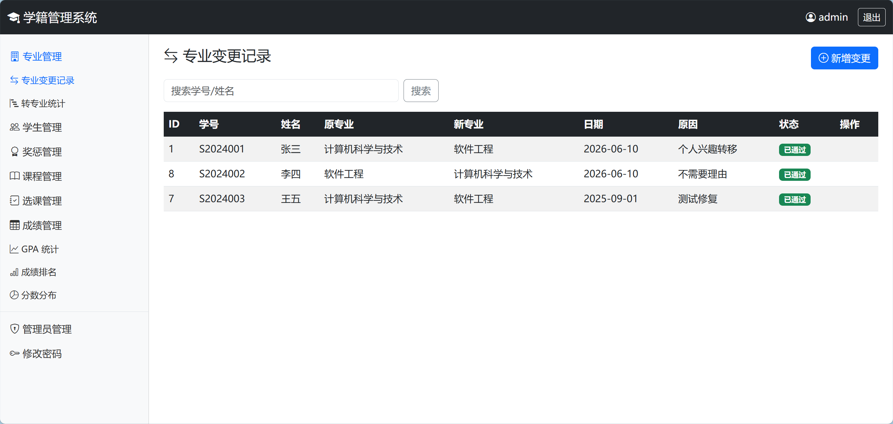

### 3.7 专业变更统计 — 转入/转出统计

<!-- TODO: 请粘贴专业变更统计截图 -->
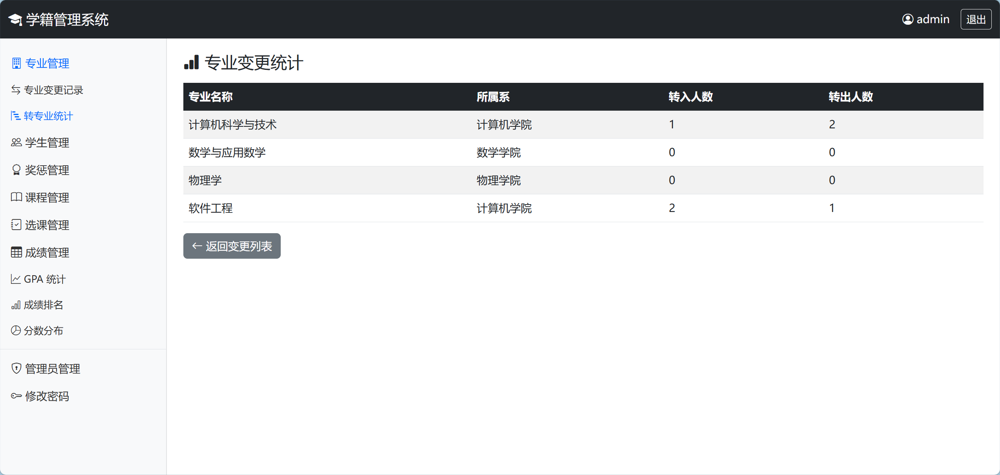

### 3.8 奖惩管理 — 列表页（含材料预览/播放/下载）

<!-- TODO: 请粘贴奖惩列表截图 -->
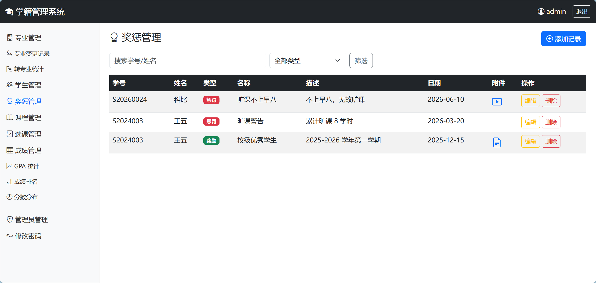

### 3.9 奖惩管理 — 添加记录（含图片/视频/文件上传）

<!-- TODO: 请粘贴奖惩添加截图 -->
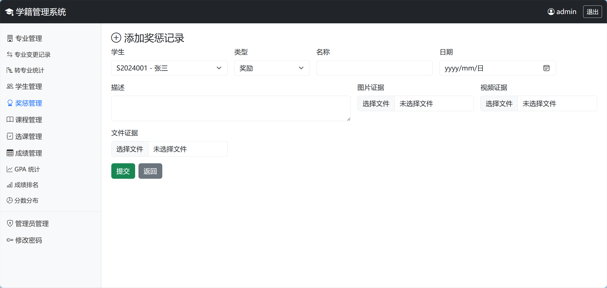

### 3.10 课程管理 — 列表页（含大纲/资料上传下载）

<!-- TODO: 请粘贴课程列表截图 -->
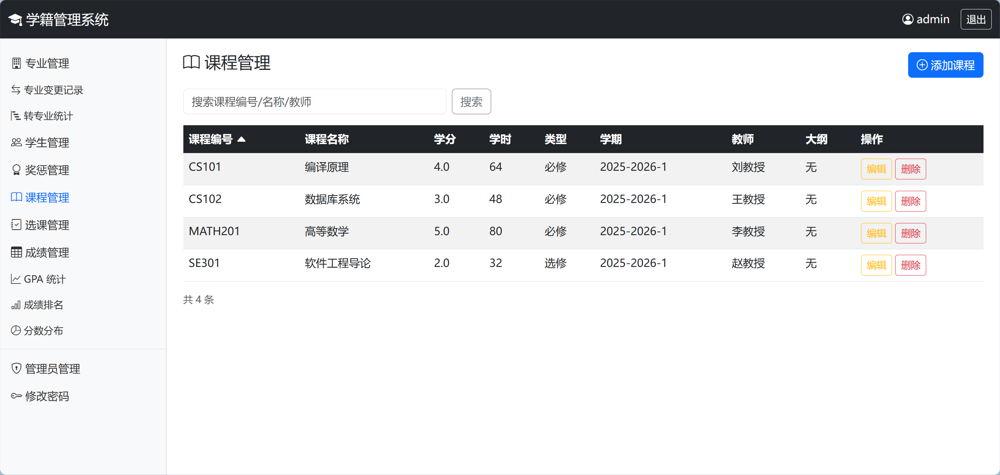

### 3.11 成绩管理 — 成绩录入与列表

<!-- TODO: 请粘贴成绩管理截图 -->
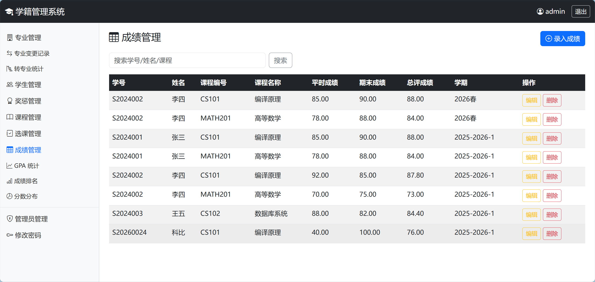

### 3.12 GPA 统计 — 存储过程 + 函数

<!-- TODO: 请粘贴 GPA 统计截图 -->
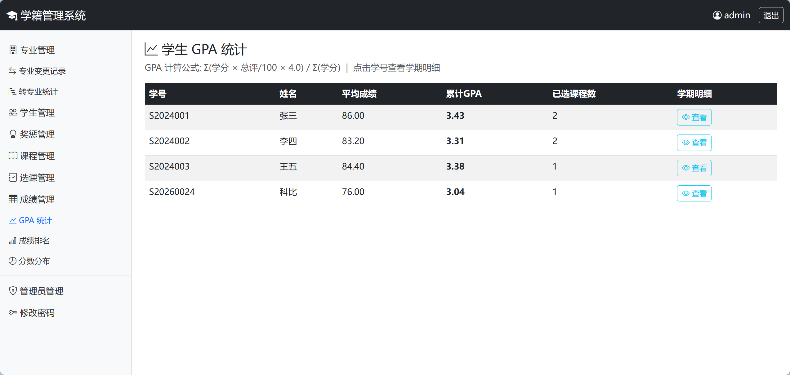

### 3.13 成绩排名 — 按课程排名（存储过程）

<!-- TODO: 请粘贴成绩排名截图 -->
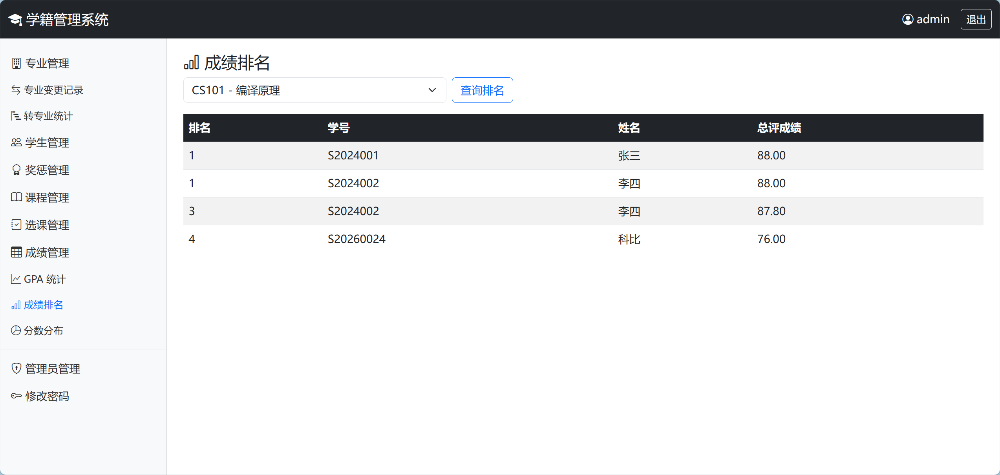

### 3.14 分数分布统计

<!-- TODO: 请粘贴分数分布截图 -->
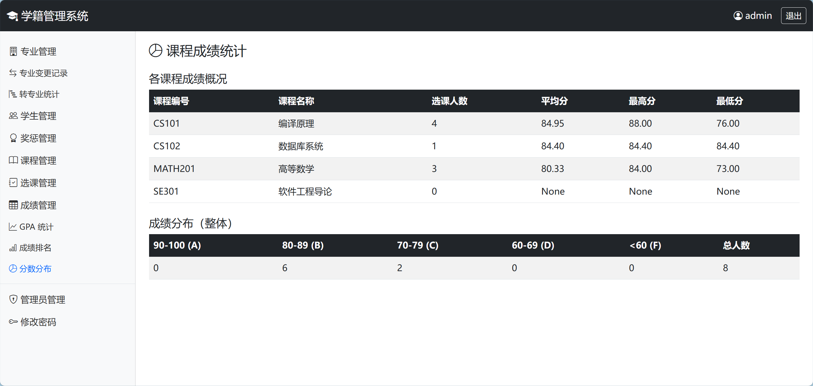

### 3.15 管理员管理 — 管理员列表

<!-- TODO: 请粘贴管理员列表截图 -->
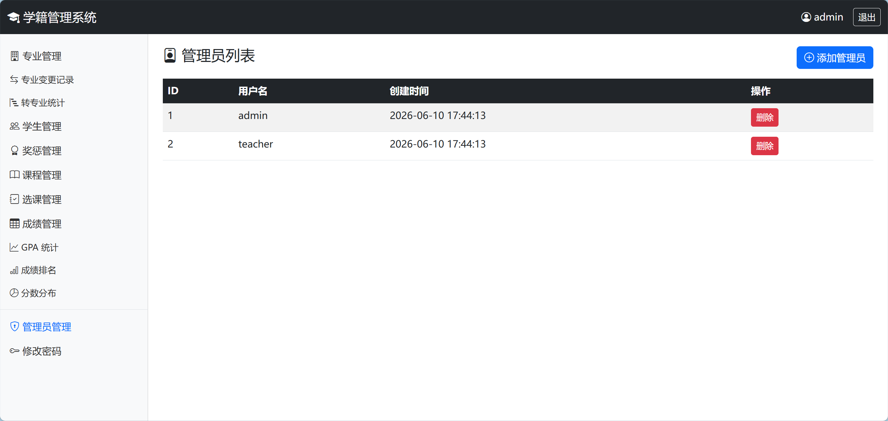

### 3.16 修改密码

<!-- TODO: 请粘贴修改密码截图 -->
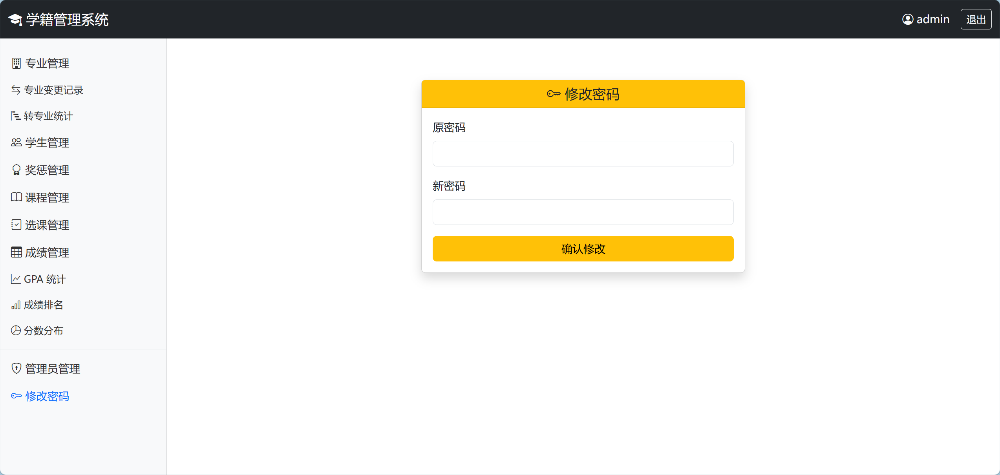

---

> **仓库地址：** https://github.com/Leeyiiii/Database-lab2
> **提交日期：** 2026 年 6 月