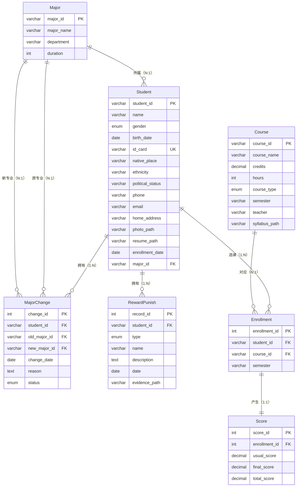

# 学籍管理系统 — 需求分析说明文档

> **课程名称：** 数据库系统及应用课程设计  
> **课题名称：** 学籍管理系统  
> **姓名：** 李易  
> **学号：** PB23111726    

---

## 目录

1. [系统概述](#1-系统概述)
2. [功能需求分析](#2-功能需求分析)
3. [数据需求分析](#3-数据需求分析)

---

## 1. 系统概述

本系统为学籍管理系统，采用 B/S 架构，旨在实现学生基本信息、专业变更、奖惩情况、课程及成绩的数字化管理，并支持图片、视频、文件的上传与管理。

**用户角色：** 系统管理员、教务管理员、教师、学生。

---

## 2. 功能需求分析

### 2.1 学生基本信息管理

| 编号 | 功能名称 | 功能描述 |
|------|----------|----------|
| F-01 | 学生信息录入 | 录入学号、姓名、性别、出生日期、身份证号、籍贯、民族、政治面貌、联系电话、邮箱、家庭地址、入学日期、所属专业 |
| F-02 | 学生信息查询 | 按学号、姓名、专业、入学日期等条件模糊或精确查询 |
| F-03 | 学生信息修改 | 修改已录入的学生基本信息 |
| F-04 | 学生信息删除 | 软删除，数据归档至历史表 |
| F-05 | 学生列表浏览 | 分页展示，支持排序 |
| F-06 | 照片上传/更换 | 上传学生证件照片（jpg、png） |
| F-07 | 照片查看/下载 | 在线预览照片，支持下载 |
| F-08 | 简历附件上传 | 上传学生个人简历（pdf、doc、docx） |
| F-09 | 简历附件下载 | 下载学生简历附件 |

### 2.2 专业变更管理

| 编号 | 功能名称 | 功能描述 |
|------|----------|----------|
| F-10 | 专业信息维护 | 专业的增删改查（专业编号、名称、院系、学制） |
| F-11 | 专业变更记录录入 | 记录学生专业变更（原专业、新专业、日期、原因） |
| F-12 | 变更审批状态更新 | 更新审批状态（待审批→已通过/已驳回） |
| F-13 | 变更历史查询 | 按学号查询全部专业变更历史 |
| F-14 | 变更统计 | 按院系/专业统计转入转出人数 |

### 2.3 奖惩情况管理

| 编号 | 功能名称 | 功能描述 |
|------|----------|----------|
| F-15 | 奖惩记录录入 | 录入奖惩信息（类型、名称、描述、日期） |
| F-16 | 奖惩记录查询 | 按学号、类型、日期范围查询 |
| F-17 | 奖惩记录修改/删除 | 修改或删除已有记录 |
| F-18 | 图片材料上传 | 上传图片证明（jpg、png） |
| F-19 | 视频材料上传 | 上传视频证明（mp4） |
| F-20 | 文件材料上传 | 上传文档证明（pdf、doc、docx） |
| F-21 | 材料在线查看 | 在线预览图片、播放视频 |
| F-22 | 材料下载 | 下载证明材料到本地 |

### 2.4 课程管理

| 编号 | 功能名称 | 功能描述 |
|------|----------|----------|
| F-23 | 课程信息录入 | 录入课程编号、名称、学分、学时、类型、学期、授课教师 |
| F-24 | 课程信息查询 | 按课程编号、名称、教师、类型查询 |
| F-25 | 课程信息修改/删除 | 修改或删除课程信息 |
| F-26 | 课程列表浏览 | 分页展示，支持排序 |
| F-27 | 教学大纲上传 | 上传课程大纲文件（pdf、doc、docx） |
| F-28 | 教学资料上传 | 上传课程相关资料 |
| F-29 | 文件下载 | 下载大纲和资料 |

### 2.5 课程成绩管理

| 编号 | 功能名称 | 功能描述 |
|------|----------|----------|
| F-30 | 选课记录管理 | 为学生添加/删除选课记录 |
| F-31 | 成绩录入 | 录入平时成绩、期末成绩 |
| F-32 | 总评自动计算 | 根据平时×40% + 期末×60% 计算总评成绩 |
| F-33 | 成绩查询 | 按学号、课程、学期查询 |
| F-34 | 成绩修改 | 修改已录入的成绩 |
| F-35 | GPA 计算 | 计算学生学期/累计 GPA（存储过程实现） |
| F-36 | 课程平均分统计 | 计算指定课程平均分（函数实现） |
| F-37 | 成绩排名 | 按课程或学期展示排名 |

### 2.6 系统管理

| 编号 | 功能名称 | 功能描述 |
|------|----------|----------|
| F-38 | 管理员登录/登出 | 用户名和密码登录 |
| F-39 | 账号管理 | 管理员账号增删改查 |
| F-40 | 密码修改 | 管理员修改登录密码 |

### 2.7 功能汇总

| 模块 | 功能数 | 多媒体覆盖 |
|------|--------|-----------|
| 学生基本信息管理 | 9 | 图片上传/查看/下载、文件上传/下载 |
| 专业变更管理 | 5 | — |
| 奖惩情况管理 | 8 | 图片/视频/文件上传、在线查看、下载 |
| 课程管理 | 7 | 文件上传/下载 |
| 课程成绩管理 | 8 | — |
| 系统管理 | 3 | — |
| **合计** | **40** | **图片、视频、文件全覆盖** |

---

## 3. 数据需求分析

### 3.1 核心数据实体

| 序号 | 实体名 | 中文名 | 描述 |
|------|--------|--------|------|
| 1 | Student | 学生 | 存储学生基本信息及多媒体文件路径 |
| 2 | Major | 专业 | 存储专业基本信息 |
| 3 | MajorChange | 专业变更记录 | 存储学生转专业的历史记录 |
| 4 | RewardPunish | 奖惩记录 | 存储学生的奖励和惩罚信息 |
| 5 | Course | 课程 | 存储课程基本信息 |
| 6 | Enrollment | 选课记录 | 存储学生与课程的选课关系 |
| 7 | Score | 成绩 | 存储学生各门课程的成绩 |
| 8 | Admin | 管理员 | 存储系统管理员账号（独立认证，不参与业务关系） |

### 3.2 概要设计 ER 图

### 3.3 实体间关系汇总

| 父实体 | 关系名 | 子实体 | 基数 | 外键 |
|--------|--------|--------|------|------|
| Major | 所属 | Student | N:1 | Student.major_id |
| Student | 拥有 | MajorChange | 1:N | MajorChange.student_id |
| Major | 原专业 | MajorChange | N:1 | MajorChange.old_major_id |
| Major | 新专业 | MajorChange | N:1 | MajorChange.new_major_id |
| Student | 拥有 | RewardPunish | 1:N | RewardPunish.student_id |
| Student | 选课 | Enrollment | 1:N | Enrollment.student_id |
| Course | 对应 | Enrollment | N:1 | Enrollment.course_id |
| Enrollment | 产生 | Score | 1:1 | Score.enrollment_id (UNIQUE) |

### 3.4 3NF 合规说明

全部 7 个业务实体满足第三范式（3NF）：
- **Student：** 所有非主属性完全函数依赖于 `student_id`，`major_id` 为外键非传递依赖
- **MajorChange：** 完全函数依赖于 `change_id`，`old_major_id`/`new_major_id` 直引 Major
- **RewardPunish：** 完全函数依赖于 `record_id`
- **Course：** 完全函数依赖于 `course_id`
- **Enrollment：** 完全函数依赖于 `enrollment_id`
- **Score：** 完全函数依赖于 `score_id`，`enrollment_id` 为 UNIQUE 外键
- 不存在部分依赖和传递依赖。
